# 第十届全国大学生集成电路创新创业大赛

- **报告类型：** 设计报告
- **参赛杯赛：** 飞腾杯
- **作品名称：** 面向极端弱网应急巡检的飞腾多核异构安全语义图像回传系统
- **副标题：** 基于 Linux 主核重建、OpenAMP 安全控制与 TVM/MNN 双引擎的系统实现
- **队伍编号：** CICC0903540
- **团队名称：** 逃离荒岛队

---

## 摘要

灾后应急、无人机巡检与现场机器人作业等极端弱网场景下，原始图像回传面临带宽不足、链路不稳定和现场无人值守等多重挑战。本文构建了一套部署在飞腾多核异构平台上的安全语义图像回传系统：上位机完成图像语义编码与信道扰动模拟，将低负载语义特征发送至飞腾端；Linux 主核利用 TVM/MNN 双引擎完成高性能图像重建、显示与存储；RTOS 从核通过 OpenAMP 实现作业准入、心跳监护与安全停机。

系统在飞腾真机上已形成完整闭环。4 核 Linux 性能模式下，TVM 主线将单张图像端到端重建时间从 1850.0 ms 降至 230.3 ms，big.LITTLE 异构流水线进一步将单张中位时间压到 134.6 ms。3 核 Linux + RTOS 演示模式下，OpenAMP 控制面完成作业准入、心跳监护与安全停机闭环，并通过三项故障注入验证；同板态公平复测中，`metaschedule+手写算子优化` 达到 242.0 ms 纯推理和 345.3 ms/image 端到端重建，优于当前 ACL 探索线。在此基础上继续沿 `mean4` 热点迭代后，最新 handwritten `mean4 v7` 线在同日同板态 serial payload 对比中进一步达到 240.1 ms（reprobe 239.1 ms），并直接优于 trusted current 的 244.6 ms 与 ACL 线的 248.2 ms；随后补齐 same-day big.LITTLE 三线 compare 后，该 handwritten 线进一步取得 `345.609 -> 249.393 ms/image` 与 `38.706%` 吞吐提升，同时优于 trusted current 的 `347.341 -> 257.388 ms/image` 与 ACL 线的 `352.158 -> 262.922 ms/image`。MNN 动态尺寸路线在 300 张不同尺寸图像上的端到端总耗时为 98.2 秒，平均 327.3 ms/image。结果表明，飞腾多核平台可以同时支撑弱网语义图像回传的性能、灵活部署与安全控制。

**主要创新与贡献：**

1. **数据面/控制面分离的多核异构架构。** Linux 主核承担 TVM/MNN 推理与重建，RTOS 从核通过 OpenAMP 提供独立的准入、监护与安全停机能力，避免高负载推理挤占安全判定路径。
2. **基于 TVM 增量调优与 Profiling 驱动算子级手写优化的深度优化链路。** 构建了“安全运行时重构 → 编译目标收敛 → 增量调优 → Profiling 定位热点 → 手写算子迭代”的完整链路，使端到端重建性能提升 87.6%。
3. **OpenAMP 确定性安全控制面与故障注入验证方法。** 设计五状态确定性状态机与五类控制消息协议，并通过三项 FIT 真机验证安全执行边界，其中 FIT-03 完成了“发现缺口 → 修复 → 复验”的完整闭环。
4. **TVM/MNN 双引擎互补与 big.LITTLE 异构流水线。** TVM 负责固定形状极致性能，MNN 负责动态尺寸灵活部署；big.LITTLE 流水线在 4 核 Linux 性能模式下将单张中位时间进一步压到 134.6 ms。

## 目录

- [摘要](#摘要)
- [1. 系统定位与总体方案](#1-系统定位与总体方案)
  - [1.1 应用场景与需求分析](#11-应用场景与需求分析)
  - [1.2 系统总体架构](#12-系统总体架构)
  - [1.3 赛题任务贴合说明](#13-赛题任务贴合说明)
- [2. 技术背景](#2-技术背景)
  - [2.1 语义通信原理](#21-语义通信原理)
  - [2.2 模型架构](#22-模型架构)
- [3. 系统设计与实现](#3-系统设计与实现)
  - [3.1 端到端工作流程](#31-端到端工作流程)
  - [3.2 飞腾多核双模式架构](#32-飞腾多核双模式架构)
  - [3.3 OpenAMP 安全控制面](#33-openamp-安全控制面)
    - [3.3.1 控制状态机](#331-控制状态机)
    - [3.3.2 控制协议与消息](#332-控制协议与消息)
    - [3.3.3 心跳监护与安全停机](#333-心跳监护与安全停机)
    - [3.3.4 故障注入验证](#334-故障注入验证)
  - [3.4 系统演示界面与演示流程](#34-系统演示界面与演示流程)
- [4. 优化方法与实验结果](#4-优化方法与实验结果)
  - [4.1 TVM 静态优化路线](#41-tvm-静态优化路线)
    - [4.1.1 编译框架级优化](#411-编译框架级优化)
    - [4.1.2 基于 Profiling 的算子级手写优化](#412-基于-profiling-的算子级手写优化)
    - [4.1.3 整模型性能结果](#413-整模型性能结果)
    - [4.1.4 图像质量与鲁棒性](#414-图像质量与鲁棒性)
    - [4.1.5 运行资源画像](#415-运行资源画像)
  - [4.2 MNN 动态尺寸路线](#42-mnn-动态尺寸路线)
  - [4.3 多核异构流水线加速](#43-多核异构流水线加速)
  - [4.4 推理框架选型与方案对比](#44-推理框架选型与方案对比)
- [5. 总结与展望](#5-总结与展望)
- [6. 参考文献](#6-参考文献)

---

## 1. 系统定位与总体方案

### 1.1 应用场景与需求分析

灾后应急、无人机巡检与现场机器人作业中，前端节点经常面临链路不稳定、带宽受限、现场无人值守等挑战。在台风过境后的灾区、偏远山区的输电线路巡检、化工园区的应急监测等场景下，现场设备必须满足三项核心需求：**传得回**（在弱网条件下完成有效图像回传）、**跑得快**（利用有限算力完成实时重建）、**用得稳**（可监护、可管控、可安全停机）。

如果仍然坚持原始图像回传，系统很容易在带宽和时延上失去可用性；如果只有单核推理演示，又无法体现多核协同与安全控制能力。语义通信技术的核心价值正在于此：不直接传输原始像素，而是发送端提取语义特征、接收端完成图像重建，从而把通信压力从像素级降到语义级[4][5]。

本系统将落点设定为“为无人机/机器人巡检任务提供弱网下可运行、可管控、可安全停机的语义图像回传底座”。相关政策和行业规范已经表明，弱网下的现场图像回传与处理不是概念需求，而是明确存在的现实需求[1][2]。

### 1.2 系统总体架构

系统采用发送端-接收端分离架构，核心分为数据面与控制面两条链路。

**数据面**负责语义编码、传输与重建：上位机完成图像预处理、Encoder 推理、语义特征量化与信道扰动模拟，再通过安全通道将紧凑 latent 发送至飞腾端；飞腾 Linux 主核利用 TVM 或 MNN 完成语义解码、图像重建、结果显示与存储。

**控制面**负责安全管控：RTOS/Bare Metal 从核通过 OpenAMP 与主核通信，承担作业准入判定、心跳监护、工件验签和安全停机等职责。控制面只传输作业编号、校验信息、心跳等小消息，不参与大数据流传输。

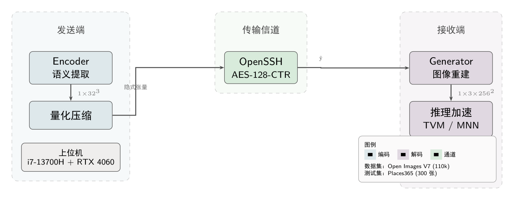

> **图 1.1** 系统总体架构图（上位机 → 飞腾 Linux 数据面 + RTOS 控制面）

为兼顾性能展示与安全控制展示，系统定义了两种运行模式：

| 对比维度 | 4 核 Linux 性能模式 | 3 核 Linux + RTOS 演示模式 |
|---------|-------------------|-------------------------|
| CPU 分配 | 4 核全部用于 Linux | 3 核 Linux + 1 核 RTOS |
| 用途 | 高性能重建与吞吐展示 | 安全控制与故障注入演示 |
| 典型结果 | 串行 231.5 ms/image，big.LITTLE 流水线 134.6 ms/image，吞吐提升 56.1% | OpenAMP 完整闭环；三路线仅 `current` 路径重建落在 345.3~353.4 ms/image |

两种模式严格区分：性能数字仅引用 4 核 Linux 模式，控制面与安全验证仅引用 3 核 + RTOS 模式。

**系统开发历程。** 项目自 2026 年 3 月启动，经历了从“飞腾端首次推理成功”到“完整系统闭环”的渐进式迭代：

| 阶段 | 时间 | 关键里程碑 |
|------|------|----------|
| 基础打通 | 2026-03-01 | 飞腾派 TVM 推理首次成功，`baseline/current` 各产出有效样本 |
| 运行时重建 | 2026-03-08~10 | 完成 TVM 0.24 安全运行时重构，解决 ARMv8.0 兼容问题，编译目标收敛至 Cortex-A72 |
| 性能突破 | 2026-03-11~13 | 增量调优策略生效，推理时间从 2479 ms 降至 152 ms；端到端重建从 1850 ms 降至 230 ms，提升 87.6% |
| 控制面闭环 | 2026-03-14~15 | OpenAMP 五类控制消息全部真机验证通过；三项 FIT 测试全部收证 |
| 异构加速 | 2026-03-18 | big.LITTLE 流水线真机验证，吞吐提升 56.1% |
| 演示集成 | 2026-03-17~30 | `current live` 300/300 跑通，Electron/Qt 演示界面完成，证据包收口 |

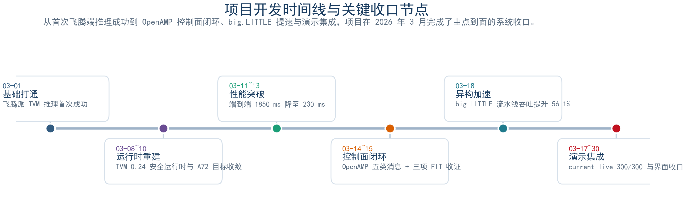

> **图 1.2** 项目开发时间线与关键收口节点（从基础打通到演示集成的阶段性收束）

如果说图 1.2 展示的是项目如何一步步收口，那么图 1.3 给出的则是当前系统状态的横向摘要：从弱网图像输入、Host 侧语义编码，到飞腾端数据面/控制面协同，再到最终的 `dashboard` 与证据入口，整条链路和关键结果都被压缩到同一页中。

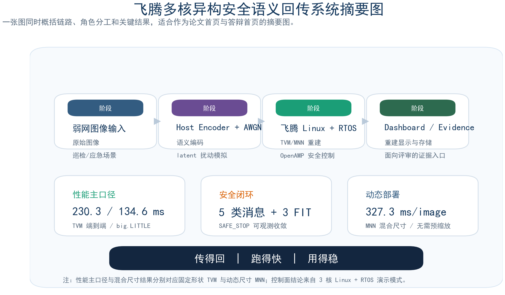

> **图 1.3** 飞腾多核异构安全语义回传系统摘要图（一张图同时概括链路、角色分工与关键结果，适合作为论文首页或答辩首页的摘要页）

实验上位机使用 2023 款联想拯救者 Y7000P，配置 NVIDIA GeForce RTX 4060 Laptop GPU（8GB）和 13th Gen Intel Core i7-13700H 处理器。上位机通过安全连接与飞腾派建立通信，将语义特征发送至板端触发解码执行。

### 1.3 赛题任务贴合说明

| 赛题层次 | 赛题要求 | 本系统对应能力 | 完成状态 | 证据章节 |
|---------|---------|-------------|--------|---------|
| 基础任务 | 上位机与飞腾端协同应用 | 上位机语义编码 + 飞腾端重建/显示/存储/回放 | 已完成 | 3.1 节流程、4.1.3 节（300 张 PNG 真机重建） |
| 中阶任务 | OpenAMP 核间通信 | STATUS/JOB/HEARTBEAT/SAFE_STOP/JOB_DONE 完整闭环 | 已完成 | 3.3.1–3.3.2 节（五类消息协议定义与真机验证） |
| 高阶任务 | Linux 主核 + RTOS 从核协同，实时响应与安全控制 | 主核推理调度 + 从核验签/准入/监护/安全停机 + FIT 验证 | 已完成 | 3.3.3–3.3.4 节（心跳监护 + 三项 FIT 测试） |

---

## 2. 技术背景

### 2.1 语义通信原理

传统通信系统中，数据经源编码压缩后由信道编码添加冗余增强抗干扰能力，收发两端不涉及对消息含义的理解[4]。语义通信在此基础上引入语义层：发送前提取消息的语义特征，接收时重构语义信息而非进行单纯比特传输。这种方式能显著减少冗余数据传输量，尤其在带宽受限场景下更有效地利用有限信道资源[5][12]。

6G 与语义通信为本项目提供了理论背景和长期方向[3][5]，但本系统的重点是利用语义通信技术解决当前已存在的弱网回传需求。当前实现使用 AWGN 扰动模拟信道影响，后续可扩展至更真实的物理链路验证。

### 2.2 模型架构

本系统采用的模型来自文献[6]（已获第一作者授权），提出了基于 GAN 的图像语义联合信源-信道编码方案（GAN-based JSCC）及其轻量化版本。

**核心思想。** 发送端 Encoder 将输入图像映射到高维特征空间，提取语义特征向量；接收端 Generator 根据经信道传输的受扰特征向量 $\hat{y}$ 重建图像：

$$\hat{x} = G(\hat{y}) \in \mathbb{R}^{H \times W \times C}$$

训练过程中，Discriminator 与 Generator 对抗训练以提升重建质量。Discriminator 仅在训练阶段使用，推理阶段只需部署 Generator。

**损失函数设计。** 为避免仅使用 MSE 损失导致重建图像模糊，模型引入 LPIPS 感知损失，综合优化以下目标：

$$L_t = \lambda L_G + \alpha L_{MSE} + \beta L_{LPIPS}$$

其中 $L_G$ 为生成对抗损失，$L_{MSE}$ 为重建保真度损失，$L_{LPIPS}$ 通过预训练 AlexNet 各层特征距离衡量感知质量。

**模型轻量化。** 为适应飞腾派等算力有限的边缘设备，采用 GAN 压缩策略：以教师模型指导学生模型训练，通过蒸馏损失使学生网络在大幅减少参数量的同时尽量保留重建质量：

$$L_{distill} = \sum_{t=1}^{T} \| f_t(f(\mathbf{y})) - f_t(\hat{f}(\mathbf{y})) \|_2^2$$

**训练数据与评估指标。** 模型使用 Open Images V7 数据集中 110,000 张图像训练。信道模型为加性高斯白噪声（AWGN）信道，以 SNR 衡量信道质量，以 PSNR 和 SSIM 评估重建质量。

**训练流程。** 分两个阶段：第一阶段训练教师模型（编码器 2 个残差块，生成器 5 个残差块），第二阶段通过通道压缩训练轻量化学生模型。本系统采用 LGJSCC-c3 轻量模型，兼顾飞腾派算力限制与重建质量。

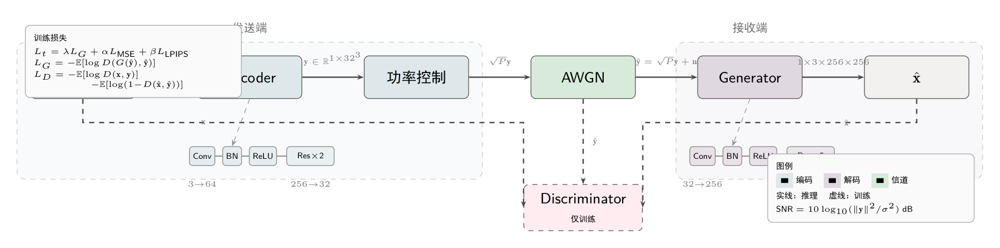

> **图 2.1** GAN-based JSCC 系统结构图（训练阶段含 Discriminator，部署阶段仅保留 Generator）

---

## 3. 系统设计与实现

### 3.1 端到端工作流程

系统的端到端工作流程遵循“上位机语义编码，飞腾端安全重建”的设计思路：

1. **语义编码：** 上位机读取待处理图片，运行 Encoder 生成紧凑 latent 张量。
2. **量化与扰动：** 对 latent 做量化和 AWGN 信道扰动模拟。
3. **安全传输：** 通过安全通道将语义特征发送至飞腾端（相比原图回传，传输负载大幅降低）。
4. **作业准入（演示模式）：** 飞腾主核通过 OpenAMP 向从核发送作业请求，从核完成工件验签与准入判定。
5. **语义重建：** 飞腾主核调用 TVM 或 MNN 执行 Generator 推理，完成图像重建。
6. **输出与存储：** 重建结果送显、PNG 落盘与结果归档。
7. **安全监护（演示模式）：** 推理过程中从核持续心跳监护，作业完成后系统回到就绪状态。

### 3.2 飞腾多核双模式架构

飞腾派 CPU 包含 2 个 1.8 GHz 大核和 2 个 1.5 GHz 小核[14]。为充分利用多核异构特性，系统设计了两种运行模式：

**4 核 Linux 性能模式**下，4 核全部用于 Linux 数据面，通过 big.LITTLE 异构流水线将推理任务分配到大核与小核，实现吞吐最大化。在该模式下，TVM 串行端到端重建中位时间为 231.5 ms/image，流水线模式下可降至 134.6 ms/image，吞吐提升 56.1%。

**3 核 Linux + RTOS 演示模式**下，通过 `remoteproc` 拉起 RTOS 控制面，Linux 可用核心数减少，但可完整展示 OpenAMP 安全控制能力。当前已在该模式下跑通全部 300 张图像推理与 OpenAMP 完整闭环，并在统一板态下完成三条 TVM 路线的公平复测：`metaschedule优化` 为 350.1 ms/image，`metaschedule+手写算子优化` 为 345.3 ms/image，当前 ACL 单热点替换探索线为 353.4 ms/image。该模式的主要作用是为安全控制展示与路线公平比较提供统一板态，而不是追求绝对最优吞吐。

### 3.3 OpenAMP 安全控制面

为避免高负载推理任务挤占控制判定路径，本系统将图像重建数据面与安全控制面解耦：Linux 主核负责 TVM/MNN 推理、显示与存储，RTOS 从核通过 OpenAMP[13] 提供独立的作业准入、运行监护与安全停机能力。该设计使系统在弱网巡检场景下不仅“能跑”，而且“可控、可停、可恢复”。引入 RTOS 从核不是为了“多一个核做通信”，而是为了让安全判定从高负载 Linux 数据面中剥离，形成独立、可预期的控制通路。

#### 3.3.1 控制状态机

RTOS 从核维护一个确定性的有限状态机，所有控制消息的合法性均由当前状态决定。系统定义以下五种核心状态：

| 状态 | 含义 | 可执行操作 |
|------|------|----------|
| READY | 空闲待命，等待新作业 | 可接受 JOB_REQ |
| CHECKING | 正在校验工件与参数 | 内部状态，不响应新请求 |
| RUNNING | 任务执行中，心跳监护激活 | 接收 HEARTBEAT、SAFE_STOP、JOB_DONE |
| SAFE_STOP | 已进入安全停机 | 仅接受 STATUS_REQ |
| FAULT | 发生故障，等待复位 | 仅接受 STATUS_REQ |

状态转移遵循以下规则：

- **READY → CHECKING：** Linux 发起 `JOB_REQ`，从核进入工件校验阶段。
- **CHECKING → RUNNING：** 校验通过，返回 `JOB_ACK(ALLOW)`，开始心跳监护。
- **CHECKING → READY：** 校验失败（工件不匹配或参数非法），返回 `JOB_ACK(DENY, reason)`，系统保持干净 READY 状态。
- **RUNNING → READY：** Linux 上报 `JOB_DONE(success)`，系统回到就绪。
- **RUNNING → SAFE_STOP：** 心跳超时或 Linux 主动发起 `SAFE_STOP`，系统进入安全收敛。
- **SAFE_STOP → READY：** 故障记录落盘后，系统自动回到可观测的安全态，等待下一轮作业。

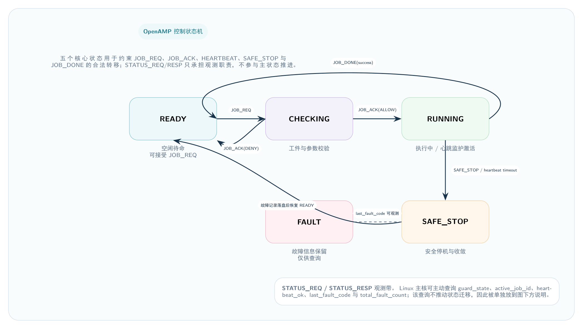

> **图 3.1** OpenAMP 控制状态机与消息转移图（覆盖 READY、CHECKING、RUNNING、SAFE_STOP、FAULT 五种核心状态）

#### 3.3.2 控制协议与消息

控制面通过 RPMsg 传输结构化二进制消息，只承载作业标识、状态与校验信息，不传输大体量图像数据，从而保证通信负载轻、响应路径稳定。

| 消息类型 | 方向 | 关键字段 | 触发条件 |
|---------|------|---------|---------|
| STATUS_REQ/RESP | 主核 ↔ 从核 | guard_state, active_job_id, last_fault_code, heartbeat_ok, total_fault_count | 主核主动查询或作业前后快照 |
| JOB_REQ/JOB_ACK | 主核 → 从核 | job_id, artifact_hash, param_digest → allow/deny, reason_code | 主核发起作业前准入请求 |
| HEARTBEAT | 从核 → 主核 | job_id, heartbeat_ok | RUNNING 状态下按周期持续上报 |
| SAFE_STOP | 主核 → 从核 | reason_code | 运行中显式停机或心跳超时触发 |
| JOB_DONE | 主核 → 从核 | job_id, result_code | 作业完成后主核上报结果 |

这些消息并非孤立存在，而是在 Linux 主核与 RTOS 从核之间形成一条固定的时序路径：先查询状态，再执行准入，允许后进入心跳监护与任务完成上报；一旦心跳丢失或人工停机，则控制面转入 SAFE_STOP/FAULT 的可观测收敛路径。

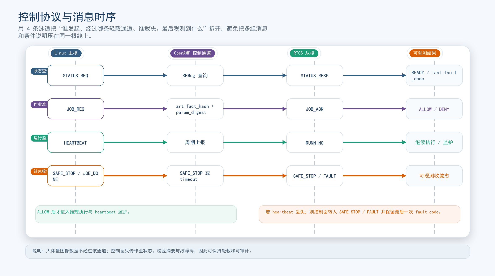

> **图 3.2** 控制协议与消息时序（STATUS_REQ、JOB_REQ、HEARTBEAT、SAFE_STOP、JOB_DONE 在 Linux 主核与 RTOS 从核之间形成轻载闭环）

**工件验签机制：** JOB_REQ 中的 `artifact_hash` 为待执行模型产物的 SHA-256 校验值。从核在 CHECKING 阶段将请求中的 hash 与预期值比对：匹配则 ALLOW，不匹配则 DENY 并记录 `ARTIFACT_SHA_MISMATCH` 故障码。`param_digest` 对输入形状、SNR 等参数进行范围校验，非法值触发 `ILLEGAL_PARAM_RANGE` 拒绝。这两种准入机制确保系统不会执行来源不明或参数异常的推理任务。

#### 3.3.3 心跳监护与安全停机

在任务运行期间（RUNNING 状态），Linux 主核按固定周期向从核上报运行心跳；RTOS 从核维护最近一次有效心跳时间窗。若连续超过阈值未收到有效心跳，则从核判定主核失联或任务失控，自动触发 SAFE_STOP 并禁止新作业进入。

**停机收敛流程：** Linux 收到安全停机判定后，中止当前重建、丢弃未完成输出并回收任务上下文。系统进入可观测的安全态（SAFE_STOP），`last_fault_code` 记录停机原因，`total_fault_count` 累加，可通过 STATUS_REQ 查询。故障记录落盘后系统回到 READY，支持下一轮作业调度。

#### 3.3.4 故障注入验证

上述控制逻辑并非静态设计，而是通过三类故障注入完成真机闭环验证，每项测试都在飞腾派上产生了可审计的控制面证据：

| 测试编号 | 注入场景 | 控制面行为 | 验证结果 |
|---------|---------|----------|---------|
| FIT-01 | 发送错误工件校验值 | CHECKING 阶段检测到 `ARTIFACT_SHA_MISMATCH`，返回 `JOB_ACK(DENY)`，执行器未启动，复验状态保持 READY | 通过 |
| FIT-02 | 注入非法输入参数 | CHECKING 阶段检测到 `ILLEGAL_PARAM_RANGE`，返回 `JOB_ACK(DENY)`，执行器未启动，复验状态保持 READY | 通过 |
| FIT-03 | 故意停发心跳超过阈值 | 从核检测到心跳超时，自动触发 `HEARTBEAT_TIMEOUT(F003)`，系统进入安全收敛，复验状态回到 READY | 通过 |

FIT-03 的验证过程特别值得说明：首轮测试时发现从核未实现自动心跳超时检测（即心跳超时后状态仍为 RUNNING），这是一个真实的安全缺口。随后在固件中补充了惰性看门狗机制，复跑同一探针后确认超时触发与安全收敛均正常。因此 FIT-03 的证据链是“发现缺口 → 定位原因 → 修复 → 复验通过”，而非一次通过的简单测试。

### 3.4 系统演示界面与演示流程

演示界面的核心目标不是展示 UI 设计，而是将“语义回传—飞腾重建—OpenAMP 控制—故障收敛”的完整闭环实时可视化，使评审能够直接观察到作业准入、心跳监护、异常触发与安全停机的真实执行过程。

系统提供 Electron 桌面端与 Qt 原生端两种前端，共享同一后端 API，可根据演示环境灵活切换。

#### 3.4.1 演示流程

演示按以下时序执行，覆盖系统从正常作业到异常处理的全闭环：

1. **模式选择：** 操作者选择运行模式——4 核 Linux 性能模式（展示“跑得快”）或 3 核 + RTOS 演示模式（展示“用得稳”）。
2. **语义回传：** 上位机完成图像编码后，将语义特征发送至飞腾端。
3. **作业准入：** Linux 主核发起 JOB_REQ，RTOS 从核校验工件与参数，返回 ALLOW 或 DENY。
4. **执行与监护：** 推理执行过程中，界面实时显示重建进度、心跳状态与结果图像。
5. **故障注入：** 操作者注入异常（错误工件/非法参数/心跳超时），观察系统拒绝或安全停机行为。
6. **安全收敛：** 界面显示停机事件与故障码，系统回到 READY。
7. **结果确认：** 查看落盘的重建图像与控制面消息日志，确认端到端闭环完成。

两种模式分别对应“跑得快”和“用得稳”两个系统目标，避免将高性能结果与安全控制结果混淆。

这里需要特别强调双模式边界：`4-core Linux performance mode` 只用于引用正式性能口径，而 `3-core Linux + RTOS demo mode` 只用于引用 OpenAMP 控制面、安全收口与现场操作流。由于 `remoteproc` 会占用一个 Linux CPU，如果把两种模式的数字直接混写，会同时破坏性能口径与演示口径的严谨性。

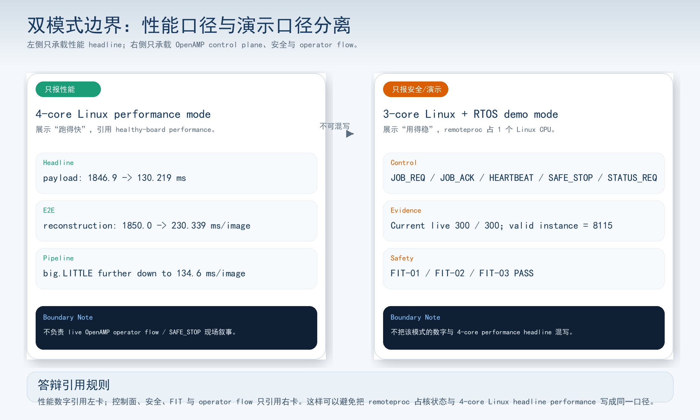

> **图 3.3** 双模式边界图（左：4-core Linux performance mode 负责正式性能口径；右：3-core Linux + RTOS demo mode 负责控制面、安全与演示闭环）

#### 3.4.2 界面元素与可验证证据

演示界面中的每个关键元素都对应一个底层事实，而非装饰性展示：

| 界面元素 | 对应底层动作 | 证明能力 |
|---------|------------|---------|
| 作业状态灯 | RTOS 状态机当前状态 | 控制面真实参与系统运行 |
| 消息时间轴 | RPMsg 控制消息收发日志 | OpenAMP 闭环过程可视化 |
| 心跳指示器 | 心跳周期内最新应答状态 | 运行中监护机制有效 |
| 故障弹窗 | FIT 注入返回的 reason_code | 安全策略真实生效 |
| 重建结果窗格 | 飞腾端实时生成的重建图像 | 数据面真实执行 |
| 性能指标面板 | 板端 benchmark 中位时间 | 系统性能可量化 |

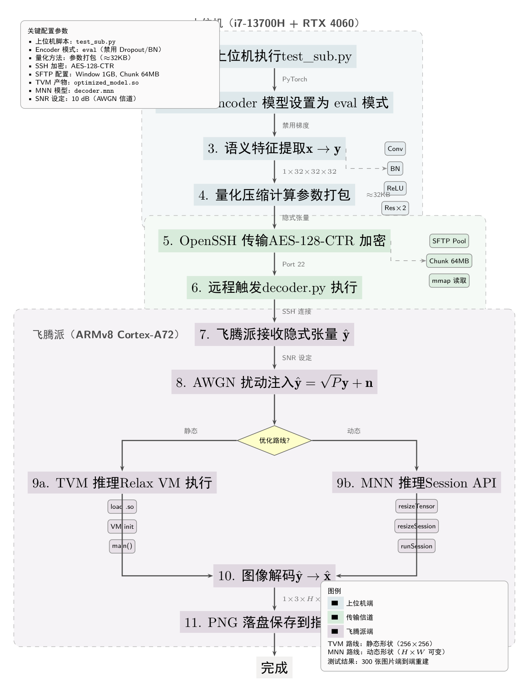

> **图 3.4** Electron 演示界面证据映射图（指标条、Current 进度、故障注入、结果对比、飞行遥测与 ML-KEM 安全链路在同一屏中完成证据对位）

图 3.4 回答的是“页面里的每个区域分别对哪条证据链负责”，而图 3.5 与图 3.6 则进一步给出真实界面层面的视觉证据。这里需要特别说明：图 3.4 至图 3.6 均直接取自 `cockpit_desktop` Electron 演示程序，不再引用早期 web 原型页面。当前正式演示页将控制面状态、Current 重建进度、结果对比、飞行遥测以及安全链路状态集中到同一屏，使评审无需翻查原始日志，即可同时看到板卡在线状态、Current 入口、300 张图进度条、Current vs Baseline 对比条与最后一次 fault 状态。

> **图 3.5** Electron 演示系统主界面截图（`cockpit_desktop` 运行态实拍，采用“证据驱动 + 操作员在环”的展示模式）

与早期概念原型不同，当前 Electron 主界面本身已经承载了演示时最常被追问的核心信息：顶栏给出在线状态、payload、baseline 与 uplift，主面板给出 Current 进度和动作入口，下方直接给出 Current vs Baseline 对比以及 PSNR/SSIM 质量指标，右侧则固定展示飞行遥测、硬件状态与 ML-KEM 安全信道。也就是说，正式演示并不依赖“翻页找证据”，而是在一个稳定的 cockpit 视图中完成主要展示。

> **图 3.6** Electron 演示系统关键细节界面（左：Current 重建、结果对比与故障注入；右：飞行遥测、硬件状态与 ML-KEM 安全信道）

考虑到论文页面宽度有限，图 3.6 对主界面中的两个高频验证区域做了局部放大：左侧集中展示 Current 进度、Current vs Baseline 条形对比、故障注入按钮与 SAFE_STOP 收口入口；右侧集中展示无人机位置、板卡遥测、最后一次 fault 与 ML-KEM 状态。这样既保留了 Electron 界面的真实样貌，又能在论文版面中把评审最关心的控制与监护信息看清楚。

---

## 4. 优化方法与实验结果

### 4.1 TVM 静态优化路线

TVM（Tensor Virtual Machine）是开源深度学习编译器[10]，通过多层次中间表示（Relax → TE → TIR）和自动调优技术（MetaSchedule）[11]实现模型的高效跨硬件部署。本节将 TVM 优化分为三个阶段展开：首先是编译框架级的系统优化（模型规范化、运行时适配、目标收敛与增量调优），然后是基于 profiling 的算子级手写优化，最后是完整的实验结果与质量评估。

> **图 4.1** TVM 编译优化流程图（从运行时收敛、目标收敛到增量调优与算子级整合）

#### 4.1.1 编译框架级优化

**（1）宿主机侧静态 ONNX 规范化。** 在上位机完成 PyTorch 解码器加载后，分阶段将计算图和参数导出为 ONNX：先生成不含参数的中间文件，再补入权重与偏置得到完整 ONNX 模型。随后使用 `onnxsim.simplify` 进行常量折叠、冗余节点消除与算子规范化，得到结构稳定的静态计算图。由于模型导出与图优化阶段计算开销较大，此步骤在高性能主机完成。规范化后的 ONNX 为后续 Relax 前端和 MetaSchedule 提供了语义等价但搜索空间更可控的静态图起点。

**（2）安全运行时重构。** 初始版本依赖的旧运行时只能支撑历史产物执行，新版本 TVM 产物一度在 import 阶段即遭遇兼容性阻塞。通过 `gdb` 追踪定位到问题根因：`SIGILL` 并非来自 TVM 本身，而是来自 PyTorch `libc10.so` 被 TVM FFI 初始化阶段的可选导入链意外拖入，与飞腾派 ARMv8.0 指令约束产生冲突。为此，在飞腾派上重建独立安全运行时：重编译 TVM C++/FFI 组件并隔离 Python 环境，关闭非必需的 torch eager 导入与 torch C DLPack hook，同时禁用 FP16/BF16、DNNL 等不适配路径。完成上述处理后，系统从“可编译但不可稳定加载”转变为“可导入、可初始化、可重复执行”的可信底座。

**（3）编译目标收敛。** 在 TVM 新版本中，编译目标统一使用结构化配置对象，需要同时符合新接口并贴近飞腾派 CPU 实际特征。基于安全运行时，在相同数据库与相同推理路径下，对四种目标配置开展真机比较：

| 编译目标配置 | 中位时间 (ms) | 方差 (ms²) | 评价 |
|------------|-------------|-----------|------|
| generic + neon | 2502.6 | — | 明显偏保守 |
| generic + neon + crypto + crc | 2482.3 | — | 有改善 |
| cortex-a72 + neon | 2481.3 | 70.6 | 性能与稳定性兼顾 |
| cortex-a72 + neon + crypto + crc | 2482.1 | 933.9 | 中位数略优但抖动大 |

综合性能与稳定性，最终收敛目标为 `cortex-a72 + neon + num-cores=4`，让代码生成与调度搜索建立在符合飞腾派微架构的硬件先验之上。

**（4）基于历史数据的增量调优。** 导入 ONNX 至 Relax IR 后，使用 `relax.get_pipeline` 与 MetaSchedule 组织编译优化。与初始版本的零预算重编译路径不同，优化后版本引入增量调优策略：以历史调优数据库中的有效记录作为种子，在新目标与新的运行时条件下继续执行 500 次非零预算搜索。该策略继承了历史对高价值调度区域的先验知识，同时允许在新环境下完成局部再学习。搜索完成后，编译并导出最终优化产物，同时对产物进行 SHA-256 校验以确保身份一致性。

**（5）真实端到端重建验证。** 补齐了完整的重建执行器，使评测不再停留在纯推理负载层面，而是完整覆盖 latent 读取、AWGN 扰动注入、VM 执行、图像解码与 PNG 落盘的真实链路。

#### 4.1.2 基于 Profiling 的算子级手写优化

在编译框架级优化完成之后，系统没有停留在自动调优结果，而是继续围绕整模型热点开展算子级手写优化。本阶段遵循“profiling 定位热点 → 构造候选 → 整模型接线 → 板端真实验证 → 保留或放弃”的闭环，并优先采用与真实部署一致的证据：OpenAMP 三核板态、当前 JSCC 计算图内 `vm.profile`，以及整模型产物的纯推理 / 完整重建 A/B。

**（1）热点识别与当前运行占比。** 基于 `metaschedule优化` 路线在 OpenAMP 三核板态下的图内 profiling，可得到当前最值得关注的热点及其占整图比例。这里的占比统一以整图运行中位时间 `358.450 ms` 为分母计算：

| 热点算子 | `metaschedule优化` 图内时间 (ms) | 占整图比例 | `metaschedule+手写算子优化` (ms) | 相对基线变化 | 当前 ACL 替换探索线 (ms) | 相对基线变化 |
|---------|-------------------------------:|----------:|--------------------------------:|------------:|------------------------:|------------:|
| `transpose1` | 55.016 | 15.3% | 48.025 | -12.7% | 47.858 | -13.0% |
| `transpose2` | 43.912 | 12.3% | 38.701 | -11.9% | 38.599 | -12.1% |
| `transpose_add6` | 40.916 | 11.4% | 34.973 | -14.5% | 35.452 | -13.4% |
| `variance3` | 3.581 | 1.0% | 2.744 | -23.4% | 3.766 | +5.2% |
| `mean4` | 3.102 | 0.9% | 4.548 | +46.6% | 11.254 | +262.8% |

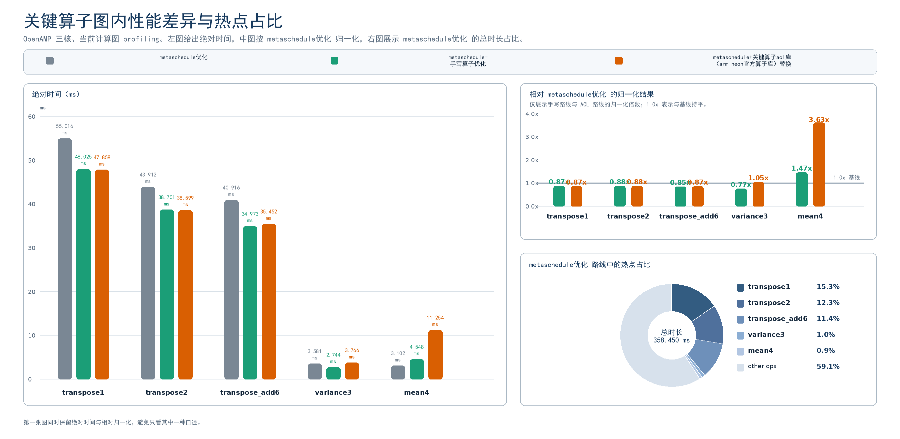

> **图 4.2** 关键算子图内性能差异与热点占比（OpenAMP 三核，当前计算图 profiling）

需要说明的是，表 4.1 与图 4.2 反映的是 `2026-04-04` 当时已集成 handwritten final 的图内 profiling 快照。此时 `mean4` 仍是 hand-written 路线中的主要拖累项，但也正因为这一点，后续优化方向被明确收敛到 `mean4` 专项迭代，而不是继续分散到其它已基本收口的热点上。

**（2）从单算子试验到多算子整合。** 当前保留下来的 handwritten 路线不是单一算子替换，而是 `transpose1`、`transpose2`、`transpose_add6`、`variance3`、`mean4` 等多处候选筛选后的整模型集成结果。其中三段 transpose 在 `2026-04-04` 的 integrated snapshot 中相对 `metaschedule优化` 均下降 11.9%~14.5%，`variance3` 进一步下降 23.4%；而 `mean4` 当时仍未继续下降，这一结果直接暴露了 hand-written 路线在该时点的主矛盾。随后系统继续沿 `mean4` lane 做专项收敛，从 `v4`、`v5`、`v6` 逐步推进到 `v7`。截至 `2026-04-06`，采用 `mean4 v7` override 的 handwritten 线在同日 OpenAMP 三核 serial payload 对比中达到 `240.059 ms`（reprobe `239.052 ms`），已直接优于 trusted current 的 `244.617 ms` 与 ACL line 的 `248.156 ms`。因此，表 4.1 中 `mean4` 的回退只代表 `2026-04-04` 的集成快照，而不再代表 `mean4` 手写 lane 的最新状态。

**（3）整模型产物闭环验证。** 本项目没有把算子级优化停留在微基准，而是将 hand-written scheduled-form 候选接回整模型编译流程，重新导出 `.so` 产物，再沿现有远端推理路径在飞腾派上跑 payload benchmark。这保证了每个候选都对应“真实整模型执行链路可验证”的结果，而不只是本地脚本跑通。

**（4）与 ACL 单热点替换探索线的公平比较。** 为回答“是否可以直接用 ACL 关键算子替换取得更高收益”的问题，本文在同一 OpenAMP 三核板态下构建了当前 ACL 探索线，并与 `metaschedule+手写算子优化` 做图内比较。需要强调的是，该 ACL 线当前仍是 `transpose_add6` 的 packed-call seam 验证线，尚未形成完整入图路径。因此，当前端到端差异的主要来源并不是 transpose 单点，而是 `variance3` 与 `mean4` 等尚未被 ACL 覆盖的部分：

| 算子 | `metaschedule+手写算子优化` (ms) | 当前 ACL 探索线 (ms) | 差值（手写 - ACL） | 解释 |
|------|--------------------------------:|--------------------:|------------------:|------|
| `mean4` | 4.548 | 11.254 | -6.706 | 当前 ACL 线未覆盖这部分关键收益 |
| `variance3` | 2.744 | 3.766 | -1.022 | handwritten 在非 transpose 热点上仍有优势 |
| `transpose_add6` | 34.973 | 35.452 | -0.479 | 单点差距已很小 |
| `transpose1` | 48.025 | 47.858 | +0.167 | 两条路线在该点几乎持平 |
| `transpose2` | 38.701 | 38.599 | +0.102 | 两条路线在该点几乎持平 |

> **表 4.1** `metaschedule+手写算子优化` 与当前 ACL 单热点替换探索线的主要图内差异（负值表示 handwritten 更快）

需要特别指出，早期曾出现 isolated standalone `transpose_add6 ACL +33.9%` 的局部正信号，但该数字在同日 OpenAMP 三核板态复测下出现明显漂移，因此本文不再将其作为主证据。当前更稳妥、也更能自洽的结论是：**在已经落地并完成验证的实现形态下，`metaschedule+手写算子优化` 的多算子整合路线优于当前 ACL 单热点替换探索线；这种领先主要来自多处算子的组合收益，而不是某一个 transpose 单点。**

#### 4.1.3 整模型性能结果

为避免将 4 核 Linux 性能模式与 3 核 Linux + RTOS 演示模式混写，本文将整模型结果分为两个口径报告。

**（1）4 核 Linux 性能模式下的主线结果。** 这一口径用于给出系统的最终性能上限。采用 Places365 数据集（256×256）进行测试：

| 对比维度 | 初始版本 | 优化后版本 | 提升幅度 |
|---------|---------|----------|---------|
| 纯推理负载时间 | 1829.3 ms | 152.8 ms | 91.6% |
| 端到端重建时间（含完整链路） | 1850.0 ms/image | 230.3 ms/image | 87.6% |
| 增量调优贡献（同环境对比） | 2479.2 ms | 152.4 ms | 93.9% (16.3x) |

端到端重建测试中，初始版本与优化版本各生成 300 张 PNG 重建图像，确保对比的完整性。这一组数据构成本文关于“TVM 主线性能突破”的核心结论。

**（2）3 核 Linux + RTOS 演示模式下的三路线公平比较。** 这一口径用于在统一 OpenAMP 板态下比较三条 TVM 路线的真实工程状态，重点回答“当前手写路线与 ACL 单热点替换探索线相比谁更成熟”。仅 `current` 路径结果如下：

| 路线 | 纯推理时间（payload, ms） | 端到端重建时间（reconstruction, ms/image） | 相对 `metaschedule优化` |
|------|-------------------------:|------------------------------------------:|------------------------|
| `metaschedule优化` | 242.628 | 350.059 | 基线 |
| `metaschedule+手写算子优化` | 242.044 | 345.267 | payload `-0.24%`，reconstruction `-1.37%` |
| 当前 ACL 单热点替换探索线 | 246.820 | 353.408 | payload `+1.73%`，reconstruction `+0.96%` |

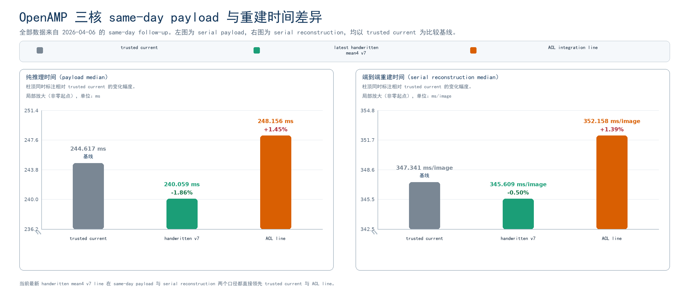

> **图 4.3** `2026-04-06` same-day follow-up 中的纯推理与串行重建差异（OpenAMP 三核统一板态；图中使用 latest handwritten `mean4 v7`、trusted current 与 ACL line 的同日结果，作为上文 `2026-04-04` 已集成快照表的最新补充）

这组结果说明了两点。第一，`metaschedule+手写算子优化` 在纯当前线 / 3 核演示模式下已经略优于 `metaschedule优化`，说明手写多算子整合并非局部幻觉，而是能够转化为整模型收益。第二，当前 ACL 线仍慢于前两条路线，因此在当前工程形态下，它更适合作为值得继续推进的探索线，而不是可以直接替代 handwritten 路线的主优化结论。

需要进一步补充的是，表中三路线仍是 `2026-04-04` 当时的已集成工程快照。后续继续沿 handwritten 线内部的 `mean4` 做专项迭代后，`mean4 v7` 在 `2026-04-06` 的同日 OpenAMP 三核 serial payload 对比中分别达到 `240.059 ms` 与 `239.052 ms`（reprobe），优于 trusted current `244.617 ms` 与 ACL line `248.156 ms`。随后又补齐了 same-day 三线 big.LITTLE compare：latest handwritten `v7` 为 `345.609 -> 249.393 ms/image`、uplift `38.706%`，trusted current 为 `347.341 -> 257.388 ms/image`、uplift `34.569%`，ACL line 为 `352.158 -> 262.922 ms/image`、uplift `33.814%`。这意味着最新 handwritten `mean4` 分支已经不只把 3 核纯推理路线的同日排序推进到 `latest handwritten mean4 line < trusted current < ACL line`，而且在同日同板态的大小核流水线 compare 下也同时取得了三项最优：serial reconstruction 最低、pipeline endpoint 最低、uplift ratio 最高。由于表 4.2 记录的是 `2026-04-04` 当时的已集成正式快照，这里仍保留原表，并将 `2026-04-06` 的最新 handwritten follow-up 作为后续增量结果单独说明。

为便于答辩时直接引用，`2026-04-06` 的 same-day serial payload compare 可单独整理为：

| 路线（same-day follow-up） | payload median (ms) | 说明 |
|------|-------------------:|------|
| latest handwritten `mean4 v7` line | 240.059 | `v7` 首轮 `repeat=30` |
| latest handwritten `mean4 v7` line（reprobe） | 239.052 | 同日回切复测 |
| trusted current | 244.617 | 同日 control |
| 当前 ACL 单热点替换探索线 | 248.156 | 同日 control |

这组同日 follow-up 说明，至少在 serial payload 口径下，最新 handwritten `mean4 v7` 线已经直接领先另外两条项目级 comparison line。

需要再次强调，表中的 ACL 路线当前仍是 `transpose_add6` 的 seam 验证线，而不是 stock ACL kernel 的完整入图路径；因此这里比较的是**已落地工程路线**的优劣，而不是孤立库函数 microbenchmark 的优劣。

**性能提升归因。** 4 核性能模式下 87.6% 的端到端提升仍然来自多个层面的协同优化：

| 优化层面 | 初始版本状态 | 优化后状态 | 归因贡献 |
|---------|-----------|----------|---------|
| 运行时 | 依赖兼容运行时，新版本产物无法加载 | 独立安全运行时，可稳定重复执行 | 解除执行前提 |
| 编译目标 | 保守的通用配置 | 面向 Cortex-A72 微架构收敛 | 提升代码生成质量 |
| 调度搜索 | 零预算重编译，沿用历史调度 | 500 次增量搜索，重新探索调度空间 | 16.3 倍纯推理加速 |
| 算子级优化 | 仅依赖自动调优结果 | Profiling 驱动 + 多算子手写整合 | 热点算子进一步收益 |
| 产物治理 | 远端产物可能漂移 | SHA-256 校验绑定 | 保证结果可追溯 |

#### 4.1.4 图像质量与鲁棒性

优化后版本不仅速度大幅提升，图像质量也保持了良好水平：

| 对比口径 | PSNR (dB) | SSIM | LPIPS |
|---------|-----------|------|-------|
| PyTorch 参考值 vs 初始版本 | 34.42 | 0.9705 | 0.0259 |
| PyTorch 参考值 vs 优化版本 | 35.66 | 0.9728 | 0.0251 |

优化版本在 PSNR 上提高了约 1.24 dB，SSIM 与 LPIPS 也有小幅提升，说明加速并未以牺牲重建质量为代价。

在不同信噪比条件下，系统展现了良好的鲁棒性：

| SNR (dB) | 重建时间 (ms/image) | PSNR (dB) | SSIM |
|----------|-------------------|-----------|------|
| 1 | 228.2 | 29.15 | 0.900 |
| 4 | 228.6 | 31.80 | 0.940 |
| 7 | 233.5 | 34.02 | 0.961 |
| 10 | 231.9 | 35.66 | 0.973 |
| 13 | 234.0 | 36.87 | 0.979 |

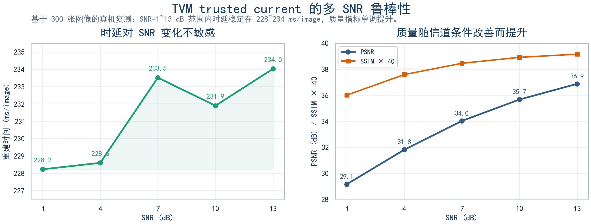

> **图 4.4** TVM trusted current 的多 SNR 鲁棒性（真机 300 张图像复测）

重建时间在 228~234 ms/image 范围内保持稳定，对 SNR 变化不敏感；图像质量随信道条件改善而稳步提升，符合“弱网下系统保持稳定时延，重建质量随信道改善而提高”的预期。

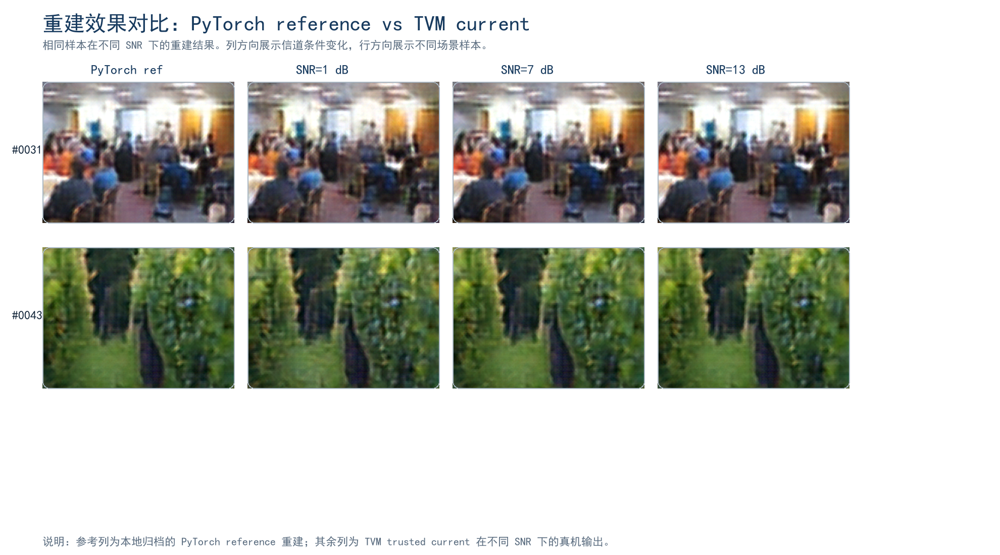

> **图 4.5** 重建效果对比：PyTorch reference 与 TVM trusted current 在不同 SNR 下的输出样例

#### 4.1.5 运行资源画像

通过板端 `vmstat`/`free`/`top` 采样，获得了优化后版本在真实重建路径下的资源使用情况：

| 指标 | 数值 |
|------|------|
| 真实重建中位时间 | 230.5 ms/image |
| CPU 使用率（user/system/idle/wait） | 32.3% / 9.1% / 58.3% / 0.3% |
| 最小空闲内存 | 88,340 KB |
| 优化产物大小 | 1.57 MiB |

系统主要瓶颈为可解释的 CPU 计算负载，I/O 等待极低；产物体积保持在端侧可管理范围内，适合资源受限的嵌入式部署场景。

为便于从整章视角回顾 TVM 主线结果，图 4.6 将 4 核 Linux 性能模式下最值得引用的六项结论汇总到同一页：时间、吞吐、质量、完整性与资源占用分别对应不同的部署判断依据。

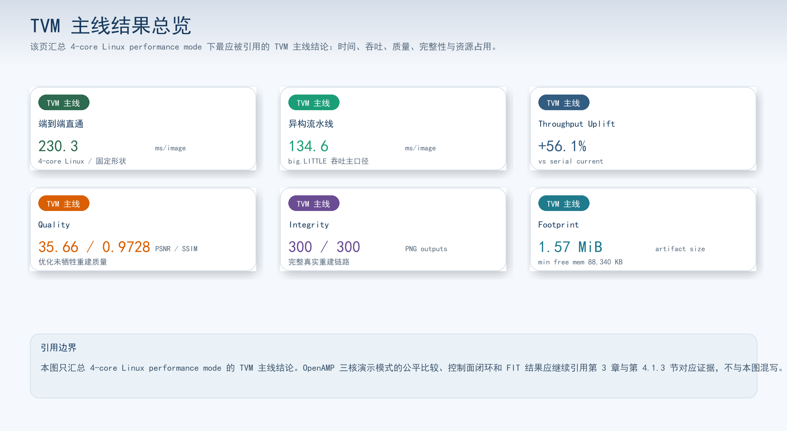

> **图 4.6** TVM 主线结果总览（仅汇总 4-core Linux performance mode 下可直接引用的 TVM 主线结论）

### 4.2 MNN 动态尺寸路线

MNN（Mobile Neural Network）是阿里巴巴开发的轻量级推理引擎，其核心创新包括几何计算机制（将转换和复合算子分解为原子算子，减少 46% 的优化工作量）和半自动搜索机制（运行时快速识别最优算子实现）[7][8]。

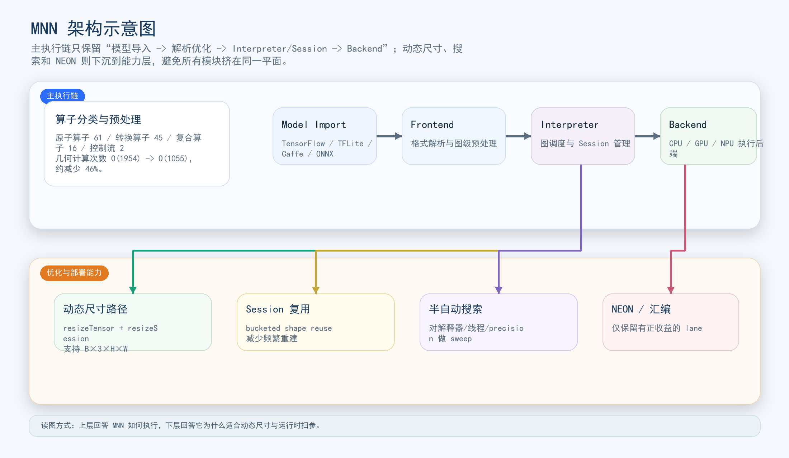

> **图 4.7** MNN 架构示意图（突出动态尺寸支持、轻量部署与运行时调度能力）

MNN 将底层张量算子分为原子算子、转换算子、复合算子和控制流算子四类，通过光栅算子（raster operator）实现几何计算。在优化层面，MNN 综合采用 Winograd 卷积加速、Strassen 矩阵乘法、ARM Neon 向量化、手写汇编优化和多线程并行等技术。

#### 4.2.1 优化方法

MNN 路线针对动态尺寸输入场景，优化分为模型导出、格式转换、并行部署和动态适配四个步骤：

1. **动态 ONNX 导出：** 在模型导出时通过 `dynamic_axes` 将高度和宽度维度标记为动态维度，使模型支持任意分辨率输入，无需为不同尺寸的巡检图像分别导出模型。
2. **MNN 模型转换：** 使用 MNN Converter 将动态 ONNX 模型转换为 `.mnn` 格式，MNN 在转换过程中保留原始模型的动态特性，并自动完成算子融合与布局优化。
3. **双 Interpreter 并行部署：** 利用飞腾派 2 大核 + 2 小核的架构，创建 2 个独立的 Interpreter 实例，各加载一份模型副本。两个 Interpreter 通过 Session API 以 round-robin 方式轮流接收推理任务，实现图像级并行：当一个 Interpreter 正在执行第 $n$ 张图的推理时，另一个 Interpreter 可同时执行第 $n+1$ 张图，从而将双核吞吐接近翻倍。
4. **动态尺寸适配：** 每张图像推理前，先通过 `resizeTensor` 将输入张量维度更新为当前图像的实际高度与宽度，再调用 `resizeSession` 触发 MNN 内部的内存重新分配与算子形状推导。该机制使同一模型可直接处理不同分辨率的输入，无需统一缩放。

在此基础上，本文补充实现了统一的 MNN 基准测试脚手架，对 `Interpreter` 数量、`Session` 线程数、precision 配置和动态尺寸模式进行同口径扫参，并统一输出结构化日志与质量报告。基于飞腾派真机复测，当前正式最优配置为 `2 interpreters + 1 thread/session + FP32(normal) + dynamic resize`；在现有板态下，`low precision` 和 `2 thread/session` 均未优于该配置。

#### 4.2.2 实验结果

**当前正式口径：** 为避免旧脚本统计方式和异常处理差异，本文后续 MNN 数据统一采用基准测试脚手架在飞腾派上的重测结果。基线配置为单 Interpreter、单线程、FP32(normal)、dynamic resize；优化配置为双 Interpreter、单线程、FP32(normal)、dynamic resize。

在飞腾派上使用 300 张不同尺寸的图片进行端到端测试，基线配置处理全部 300 张图片总耗时为 **140.7 秒**（单张平均约 469.1 ms）；优化配置处理全部 300 张图片总耗时为 **98.2 秒**（单张平均约 327.3 ms），相对基线提升 **1.43 倍**。额外扫参表明：在当前板态下，`low precision` 配置总耗时为 99.1 秒，`2 interpreters + 2 threads/session` 总耗时为 101.3 秒，均未优于当前正式最优配置。

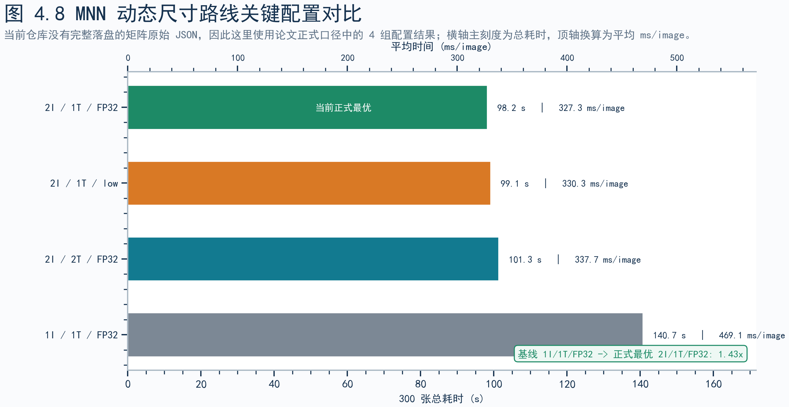

> **图 4.8** MNN 动态尺寸路线关键配置对比（300 张不同尺寸图像基准测试脚手架真机复测）

| 对比维度 | 单 Interpreter 基线 | 双 Interpreter 优化 | 提升 |
|---------|-------------------|-------------------|------|
| 300 张总耗时 | 140.7 s | 98.2 s | 1.43x |
| 单张平均时间 | 469.1 ms | 327.3 ms | 1.43x |
| 动态尺寸支持 | 支持 | 支持 | — |

**与 TVM 路线的对比：** 在相同 256×256 固定输入下，TVM 端到端重建中位时间为 230.3 ms，仍优于 MNN 当前正式口径下的 327.3 ms/image。TVM 的优势源于编译器级深度调优（MetaSchedule 搜索 + 手写算子优化），但 TVM 路线仅支持固定形状输入。MNN 的核心价值在于对动态尺寸的原生支持——实际巡检场景中图像分辨率不统一，MNN 无需缩放即可直接处理，避免了缩放带来的信息损失。

**双引擎协同定位：** 在本系统中，TVM 与 MNN 并非相互替代，而是服务于不同的部署需求。TVM 路线在固定分辨率批量处理场景下提供极致性能（如标准化巡检图像的快速重建），MNN 路线在分辨率不确定的灵活部署场景下提供即时适配能力（如多源多尺寸图像的实时处理）。两者共享同一套上位机编码流程和飞腾端输出管线，通过运行时配置切换工作模式。

**进一步优化空间：** 当前 MNN 路线的正式最优配置仍运行在 FP32(normal) 精度下。虽然本文已完成 `low precision` 和多线程配置的同口径扫参，但在当前飞腾派板态上尚未获得额外收益。MNN 原生支持 FP16 权重压缩和 INT8 训练后量化[9]，同时本文已预留 bucketed session reuse 与 auto-backend 调优接口，后续仍有进一步优化空间。

### 4.3 多核异构流水线加速

飞腾派 CPU 采用 big.LITTLE 异构架构（2 个 1.8 GHz Cortex-A72 大核 + 2 个 1.5 GHz Cortex-A55 小核）。串行模式下，推理、数据加载与结果写盘依次执行，大核在等待 I/O 时处于空闲状态。为实现吞吐最大化，系统设计了计算与 I/O 分离的异构流水线。

**流水线调度策略。** 通过 Linux `sched_setaffinity` 系统调用将不同角色的进程绑定到对应核心组：大核（Cortex-A72）专注 TVM 推理计算，小核（Cortex-A55）负责 latent 文件预加载和 PNG 后处理写盘。具体而言，系统启动三个协同进程：预加载进程（小核）从磁盘读取下一批 latent 张量并写入共享队列；推理进程（大核）从队列取数据执行 TVM VM 推理；后处理进程（小核）将推理结果转换为 PNG 格式并落盘。三个阶段形成时间重叠的流水线——当大核推理第 $n$ 张图时，小核同时在预加载第 $n+1$ 张并写盘第 $n-1$ 张的结果。

**实验结果。** 为避免不同板态混写，这里将 4 核 Linux 性能模式与 3 核 Linux + RTOS 演示模式的流水线结果分别给出。

首先，在 4 核 Linux 性能模式下，使用同一 TVM 优化产物、同一 300 张 latent 输入（SNR=10），在同轮健康板态下进行串行与流水线的同口径公平对比：

| 对比维度 | 串行模式 | big.LITTLE 流水线 | 提升 |
|---------|---------|-----------------|------|
| 单张中位时间 | 231.5 ms/image | 134.6 ms/image | — |
| 300 张总耗时 | 69.3 s | 44.4 s | 35.9% |
| 吞吐量 | 4.33 images/s | 6.76 images/s | **+56.1%** |

其次，在 3 核 Linux + RTOS 演示模式下，三条路线的 serial-vs-pipeline compare 如下：

| 路线 | 串行时间（ms/image） | big.LITTLE 流水线（ms/image） | Throughput uplift |
|------|--------------------:|------------------------------:|------------------:|
| `metaschedule优化` | 360.218 | 251.913 | 44.102% |
| `metaschedule+手写算子优化` | 342.927 | 252.584 | 35.489% |
| 当前 ACL 单热点替换探索线 | 349.374 | 258.933 | 34.705% |

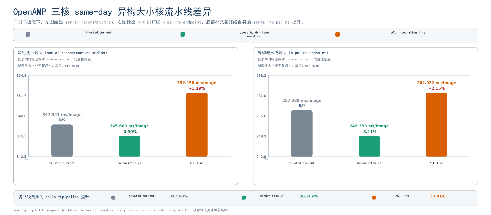

> **图 4.9** `2026-04-06` same-day follow-up 中的异构大小核流水线性能差异（OpenAMP 三核、同日三线 compare；图中直接展示 latest handwritten `mean4 v7`、trusted current 与 ACL line 的 serial-vs-pipeline 结果）

需要补充说明的是，上表仍是 `2026-04-04` 的三路线正式 compare 快照。后续继续沿 handwritten 线内部推进 `mean4 v7` 后，在 `2026-04-06` 又补齐了 same-day 三线 big.LITTLE compare：latest handwritten `v7` 为 `345.609 -> 249.393 ms/image`、uplift `38.706%`，trusted current 为 `347.341 -> 257.388 ms/image`、uplift `34.569%`，ACL line 为 `352.158 -> 262.922 ms/image`、uplift `33.814%`。因此，最新 handwritten 路线在 OpenAMP 三核口径下的最强结论应更新为：**不只是 pipeline absolute endpoint 最优，而且 same-day uplift ratio 也已经领先另外两条项目级 comparison line**。

同样地，`2026-04-06` 的 same-day big.LITTLE compare 可整理为：

| 路线（same-day follow-up） | 串行时间（ms/image） | big.LITTLE 流水线（ms/image） | Throughput uplift |
|------|--------------------:|------------------------------:|------------------:|
| latest handwritten `mean4 v7` line | 345.609 | 249.393 | 38.706% |
| trusted current | 347.341 | 257.388 | 34.569% |
| 当前 ACL 单热点替换探索线 | 352.158 | 262.922 | 33.814% |

因此，若以同日同板态的三线 compare 作为当前最强口径，handwritten `mean4 v7` 已经同时取得串行 reconstruction 最低、pipeline endpoint 最低与 uplift 最高。

需要注意区分两个时间截面。若只看表中的 `2026-04-04` 已集成快照，那么当时的 `metaschedule+手写算子优化` 虽然在串行端到端口径略优于 `metaschedule优化`，但其流水线收益仍低于 `metaschedule优化` 基线；ACL 探索线也获得了明确正收益，但整体仍落后于前两条路线。后续 `2026-04-06` 的 handwritten `mean4 v7` follow-up 则进一步把这一点向前推进，最终在 same-day 三线 compare 中同时拿到了最低 serial reconstruction、最低 pipeline endpoint 与最高 uplift ratio。

**瓶颈分析。** 在 4 核 Linux 性能模式下，吞吐提升为 56.1% 而非接近 100%，原因在于大核推理仍是流水线的主导瓶颈——每张图的 TVM 推理时间约 150 ms，而小核的 I/O 操作（latent 读取 + PNG 编码写盘）合计约 80 ms。流水线有效隐藏了 I/O 等待时间，但无法缩短推理本身的延迟。在当前负载下，大核利用率从串行模式的约 50%（推理与 I/O 交替空闲）提升至流水线模式的 90% 以上。

该结果回答了“为什么必须用飞腾多核”的问题：单核跑通模型只是起点，基于 big.LITTLE 异构特征的流水线调度才能充分发挥飞腾平台硬件优势，将系统吞吐推向实用水平；同时，不同板态与不同路线的流水线收益必须分口径报告，不能简单把 4 核性能模式的结论外推到 3 核 OpenAMP 演示模式。

### 4.4 推理框架选型与方案对比

**推理框架选型依据。** 飞腾派端侧推理的主流选择包括 TVM、MNN、NCNN 和 ONNX Runtime 等。本系统最终选择 TVM + MNN 双引擎组合。原因很直接：TVM 作为深度学习编译器[10]，通过 Relax IR 和 MetaSchedule[11]提供了从计算图到目标代码的完整优化链路，适合围绕飞腾派 Cortex-A72 微架构做深度定制；MNN 作为轻量级推理引擎[7][8]，对动态输入形状支持成熟，模型转换链稳定，适合作为 TVM 静态路线的动态形状补充。相比之下，NCNN 缺少编译器级自动调优能力，ONNX Runtime 通用性强但缺少面向特定微架构的深度优化空间。

从实际部署结果看，双引擎并不是简单的“谁更快就保留谁”。TVM 在固定形状、固定产物和多核异构流水线条件下给出当前最强性能主口径；MNN 则在混合尺寸输入、无需额外缩放的部署场景中更具工程灵活性。因此，本文最终采用“TVM 负责固定形状极致性能，MNN 负责动态尺寸灵活部署”的双轨方案。

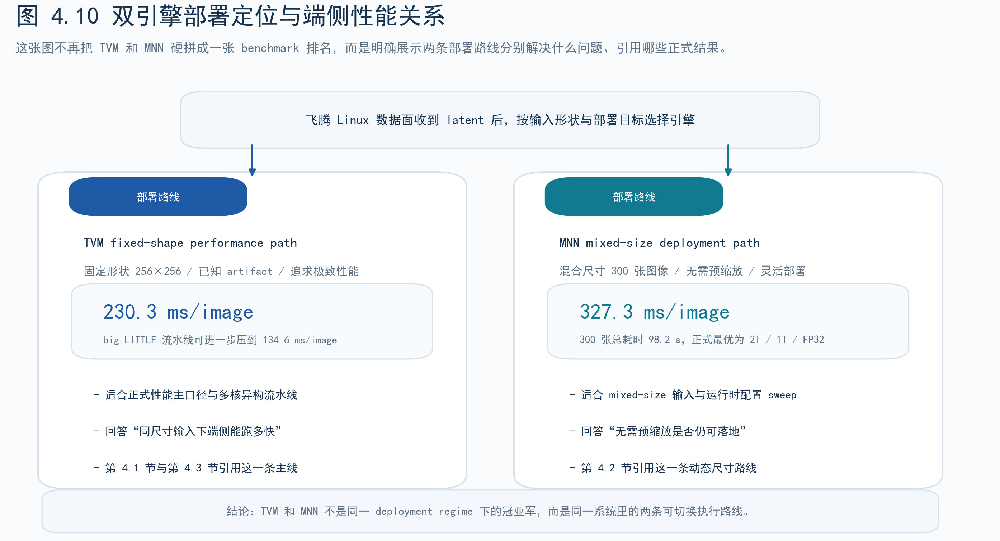

> **图 4.10** 双引擎部署定位与端侧性能关系（TVM 负责固定形状性能主口径，MNN 负责动态尺寸灵活部署；OpenAMP 演示模式的控制/安全结论不与本图 latency 混写）

**与传统图像压缩的对比。** 语义通信与传统图像压缩（如 JPEG、H.265）的根本区别在于传输内容：传统方案压缩并传输像素级数据，语义通信则在发送端提取语义特征、在接收端重建图像。在本系统中，Encoder 将 256×256 图像编码为 32×32×32 的 latent 张量（约 128 KB FP32），相比原始 RGB 图像（约 192 KB）压缩比约 1.5 倍；而在更低 SNR 条件下，语义通信的重建质量衰减远缓于传统压缩方案——文献[6]的实验表明，在 SNR=1 dB 的极端弱网条件下，GAN-based JSCC 的 PSNR 仍可达 29 dB 以上，而传统 JPEG + 信道编码方案在同等条件下已基本不可用。这一特性使语义通信在本系统面向的弱网巡检场景中具有不可替代的优势。

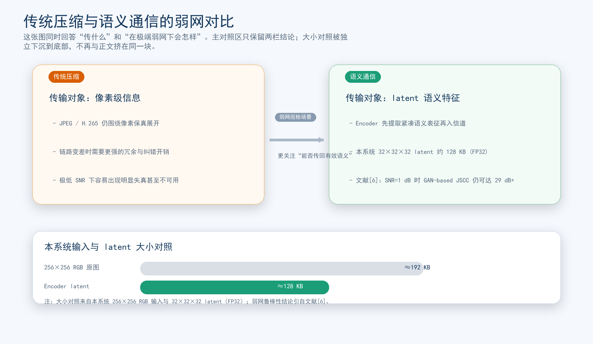

> **图 4.11** 传统压缩与语义通信的弱网对比（同时对比“传什么”和“弱网下会怎样”；大小对照来自本系统 `256×256 RGB` 输入与 `32×32×32 latent`，弱网鲁棒性结论引自文献[6]）

至此，第 4 章形成了一条相对完整的论证链：4.1 与 4.3 说明 TVM 主线如何把固定形状路径做快，4.2 说明 MNN 如何承担动态尺寸旁路，4.4 则解释为何最终不是“二选一”，而是保留双引擎协同的系统方案。

---

## 5. 总结与展望

本文构建了一套面向极端弱网应急巡检场景的飞腾多核异构安全语义图像回传系统。上位机负责语义编码与弱网扰动模拟，飞腾 Linux 主核负责重建、显示和存储，RTOS 从核通过 OpenAMP 负责准入、心跳监护与安全停机，最终实现“传得回、跑得快、用得稳”的系统目标。

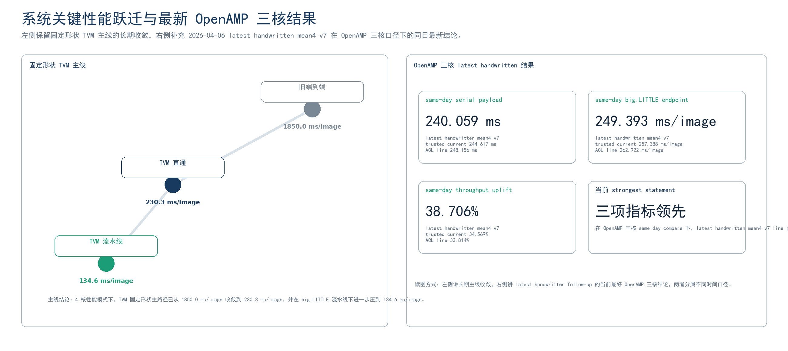

> **图 5.1** 系统关键性能跃迁（左侧保留固定形状 TVM 主线从初始端到端 1850.0 ms/image 收敛到 TVM 主线 230.3 ms/image，并在 big.LITTLE 流水线下进一步压到 134.6 ms/image；右侧补充 OpenAMP 三核口径下 latest handwritten `mean4 v7` 的 same-day follow-up：serial payload `240.059 ms`、big.LITTLE endpoint `249.393 ms/image`；MNN 动态尺寸路线作为混合尺寸部署旁路）

**核心成果汇总：**

| 成果维度 | 关键指标 | 详见 |
|---------|---------|------|
| 语义重建性能 | TVM 端到端提升 87.6%，纯推理加速 16.3 倍 | 4.1.3 节 |
| 路线公平比较 | 3 核演示模式下，`2026-04-06` 的 latest handwritten `mean4 v7` 线在 same-day serial payload 上达到 `240.059 ms`（reprobe `239.052 ms`），并直接优于 trusted current `244.617 ms` 与 ACL line `248.156 ms`；same-day big.LITTLE compare 下又达到 `345.609 -> 249.393 ms/image`、uplift `38.706%`，三项指标均为当日三线最优 | 4.1.2–4.3 节 |
| 图像质量保持 | PSNR 35.66 dB / SSIM 0.9728，优化未损失质量 | 4.1.4 节 |
| 多核吞吐加速 | 4 核性能模式吞吐提升 56.1%；3 核演示模式下 latest handwritten `mean4 v7` line 在 same-day compare 下达到 `38.706%` uplift，并优于 trusted current `34.569%` 与 ACL line `33.814%` | 4.3 节 |
| 动态尺寸支持 | MNN 300 张混合尺寸图像 98.2 秒完成，平均 327.3 ms/image | 4.2 节 |
| 安全控制闭环 | 5 类控制消息 + 3 项 FIT 测试全部真机通过 | 3.3 节 |
| 信道鲁棒性 | SNR 1~13 dB 全范围重建时延稳定在 228~234 ms | 4.1.4 节 |

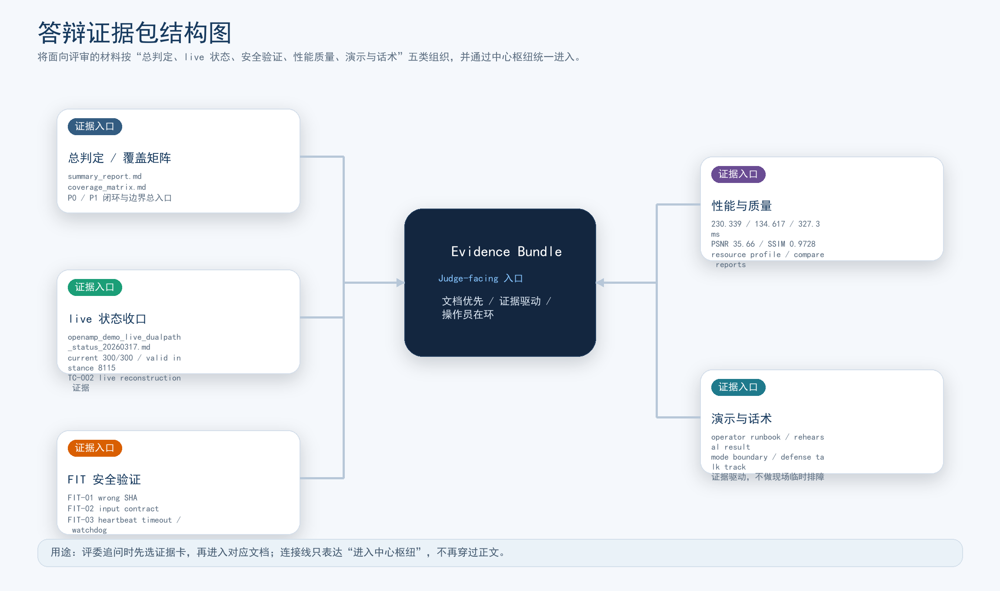

> **图 5.2** 答辩证据包结构图（将面向评审的材料按“总判定、live 状态、安全验证、性能质量、演示话术”五类组织，避免现场翻阅时临时拼凑证据）

图 5.2 回答的是“评审如果追问，应当从哪里进入证据”；而系统层面的最终概括仍要回到数据面、控制面与展示面的协同关系上。TVM 与 MNN 分别承担固定形状极致性能与动态尺寸灵活部署的角色，共同服务于飞腾端数据面；OpenAMP 控制面则提供准入、监护和安全停机能力。数据面与控制面分离，既保证了高性能结果，也使多核异构协同的角色更加清晰。

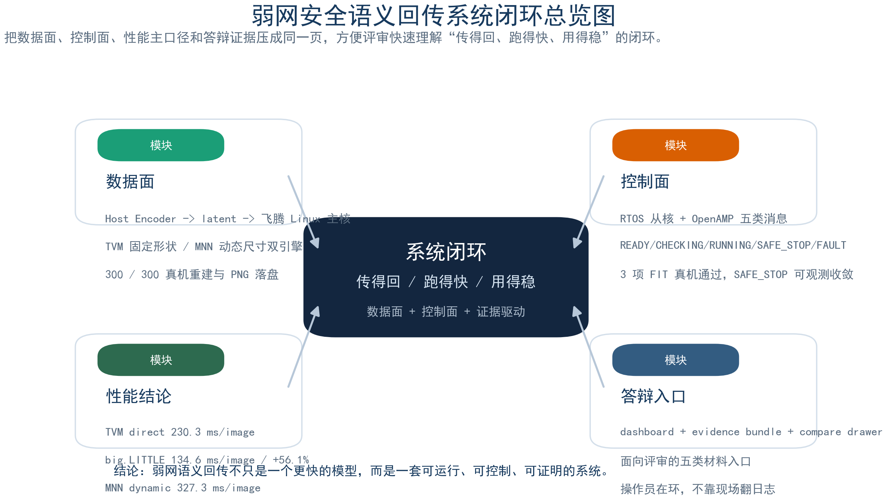

> **图 5.3** 弱网安全语义回传系统闭环总览图（把数据面、控制面、性能主口径与答辩证据入口压到同一页，直接对应“传得回、跑得快、用得稳”的系统级结论）

**当前局限性：**

1. **信道模型为 AWGN 仿真。** 当前系统使用加性高斯白噪声模拟信道影响，尚未在真实物理无线信道（如 WiFi 衰落、短波链路）上验证端到端性能。AWGN 模型不包含多径衰落、时变特性等真实信道效应，实际部署时重建质量可能受到额外影响。
2. **TVM 路线仅支持固定输入形状。** TVM 编译产物绑定固定的 1×32×32×32 输入（对应 256×256 图像），不同分辨率的图像需由 MNN 路线处理或预缩放至标准尺寸。
3. **安全停机为软件状态。** SAFE_STOP 当前仅体现为 RTOS 状态机的状态转移与 Linux 侧的任务回收，未接入物理执行器（如继电器断电、蜂鸣器告警），在无人值守场景下的现场安全收敛能力有待增强。
4. **全精度推理，未做量化。** 当前 TVM 和 MNN 路线均运行在 FP32 精度下。飞腾派搭载的 Cortex-A72 为 ARMv8.0 架构，不具备 ARMv8.2 的原生 FP16 运算扩展，INT8 量化虽硬件可行但需额外的校准数据集与精度验证，本阶段未纳入。
5. **ACL 路线仍处于探索态。** 当前文中所述 ACL 单热点替换线主要用于验证 `transpose_add6` 的 packed-call seam，尚未完成 stock ACL kernel 的整图级入图与多算子覆盖，因此相关结果应视为探索线证据，而不是最终替代 handwritten 路线的成熟方案。

**后续工作方向：**

1. 补充物理安全闭环（按钮、LED、蜂鸣器或继电器），使 SAFE_STOP 从软件状态升级为现场动作。
2. 引入更真实的弱网仿真与物理链路验证（限速、丢包、短波等场景）。
3. 探索 MNN FP16/INT8 量化与 TVM 对动态形状模型的支持，进一步压缩推理延迟。
4. 在现有 FIT 基础上扩展 RESET_REQ、deadline enforcement 等高阶控制能力。

---

## 6. 参考文献

1. 工业和信息化部. 《关于加强极端场景应急通信能力建设的意见》解读[EB/OL]. 2025-01-21.
2. 生态环境部. 《无人机环境遥感监测基本作业规范（征求意见稿）》编制说明[EB/OL]. 2025.
3. Dang S, Amin O, Shihada B, et al. What should 6G be?[J]. Nature Electronics, 2020, 3(1): 20-29.
4. Luo X, Chen H H, Guo Q. Semantic communications: Overview, open issues, and future research directions[J]. IEEE Wireless Communications, 2022, 29(1): 210-219.
5. Popovski P, Simeone O, Boccardi F, et al. A perspective on time toward wireless 6G[J]. Proceedings of the IEEE, 2022, 110(8): 1116-1146.
6. Ye D, Wang X, Chen X. Lightweight Generative Joint Source-Channel Coding for Semantic Image Transmission with Compressed Conditional GANs[C]//2023 IEEE/CIC International Conference on Communications in China (ICCC Workshops). IEEE, 2023: 1-6.
7. Lv C, Niu C, Gu R, et al. Walle: An End-to-End, General-Purpose, and Large-Scale Production System for Device-Cloud Collaborative Machine Learning[C]//16th USENIX Symposium on Operating Systems Design and Implementation (OSDI 22). 2022: 249-265.
8. Alibaba. MNN: Mobile Neural Network[EB/OL]. https://github.com/alibaba/MNN, 2019.
9. MNN Documentation. Inference: Session API[EB/OL]. https://mnn-docs.readthedocs.io/en/latest/inference/session.html, 2024.
10. Chen T, Moreau T, Jiang Z, et al. TVM: An Automated End-to-End Optimizing Compiler for Deep Learning[C]//13th USENIX Symposium on Operating Systems Design and Implementation (OSDI 18). 2018: 578-594.
11. Shao J, Feng S, Jiang Z, et al. Tensor Program Optimization with Probabilistic Programs[C]//Advances in Neural Information Processing Systems (NeurIPS). 2022.
12. Xie H, Qin Z, Li G Y, et al. Deep Learning Enabled Semantic Communication Systems[J]. IEEE Transactions on Signal Processing, 2021, 69: 2663-2675.
13. OpenAMP Project. Open Asymmetric Multi-Processing Framework[EB/OL]. https://www.openampproject.org/, 2024.
14. Phytium Technology. 飞腾派开发板用户手册[EB/OL]. https://www.phytium.com.cn/, 2024.
