# 第十届全国大学生集成电路创新创业大赛

- **报告类型：** 设计报告
- **参赛杯赛：** 飞腾杯
- **作品名称：** 面向极端弱网应急巡检的飞腾多核异构安全语义图像回传系统
- **副标题：** 基于 Linux 主核重建、OpenAMP 安全控制与 TVM/MNN 双引擎的系统实现
- **队伍编号：** CICC0903540
- **团队名称：** 逃离荒岛队

---

## 摘要

灾后应急、无人机巡检与现场机器人作业等极端弱网场景下，原始图像回传面临带宽不足、链路不稳定和现场无人值守等多重挑战。本文构建了一套部署在飞腾多核异构平台上的安全语义图像回传系统：上位机完成图像语义编码与信道扰动模拟，将低负载语义特征发送至飞腾端；Linux 主核利用 TVM/MNN 双引擎完成高性能图像重建、显示与存储；RTOS 从核通过 OpenAMP 实现作业准入、心跳监护与安全停机。

系统在飞腾真机上已形成完整闭环。4 核 Linux 性能模式下，TVM 主线通过编译器级优化将单张图像端到端重建时间从 1850 ms 降至 230 ms；big.LITTLE 异构流水线进一步将单张中位时间压到 134.6 ms。3 核 Linux + RTOS 演示模式下，OpenAMP 控制面完成作业准入、心跳监护与安全停机闭环，并通过三项故障注入验证。本文在 MetaSchedule 自动调优基础上，继续对热点算子开展手写优化：转置卷积算子通过 bias 融合消除中间缓冲，方差计算算子通过逐通道本地缓冲复用减少全帧写回，归一化算子依次完成参数逐通道提取、仿射变换预计算和 NEON 向量归约，端到端重建性能提升 87.6%。MNN 动态尺寸路线支持 300 张不同分辨率图像的直接处理，端到端总耗时 98.2 秒（平均 327.3 ms/张）。结果表明，飞腾多核平台可以同时支撑弱网语义图像回传的实时性能、灵活部署与安全控制。

**主要创新与贡献：**

1. **数据面/控制面分离的多核异构架构。** Linux 主核承担 TVM/MNN 推理与重建，RTOS 从核通过 OpenAMP 提供独立的准入、监护与安全停机能力，避免高负载推理挤占安全判定路径。
2. **基于 TVM 增量调优、Profiling 与算子级手写迭代的深度优化链路。** 构建了“安全运行时重构 → 编译目标收敛 → 增量调优 → 热点定位 → 手写改写 → 整模型验证”的完整闭环；其中转置卷积算子采用中间缓冲消除与 bias 融合，方差计算算子采用逐通道本地缓冲复用，归一化算子采用参数提取、仿射预计算与 NEON 向量归约，使端到端重建性能提升 87.6%。
3. **OpenAMP 确定性安全控制面与故障注入验证方法。** 设计五状态确定性状态机与五类控制消息协议，并通过三项 FIT 真机验证安全执行边界，其中 FIT-03 完成了“发现缺口 → 修复 → 复验”的完整闭环。
4. **TVM/MNN 双引擎互补与 big.LITTLE 异构流水线。** TVM 负责固定形状极致性能，MNN 负责动态尺寸灵活部署；big.LITTLE 流水线在 4 核 Linux 性能模式下将单张中位时间进一步压到 134.6 ms。

## 目录

- [摘要](#摘要)
- [1. 系统定位与总体方案](#1-系统定位与总体方案)
  - [1.1 应用场景与需求分析](#11-应用场景与需求分析)
  - [1.2 系统总体架构](#12-系统总体架构)
  - [1.3 赛题任务贴合说明](#13-赛题任务贴合说明)
- [2. 技术背景](#2-技术背景)
  - [2.1 语义通信原理](#21-语义通信原理)
  - [2.2 模型架构](#22-模型架构)
- [3. 系统设计与实现](#3-系统设计与实现)
  - [3.1 端到端工作流程](#31-端到端工作流程)
  - [3.2 飞腾多核双模式架构](#32-飞腾多核双模式架构)
  - [3.3 OpenAMP 安全控制面](#33-openamp-安全控制面)
    - [3.3.1 控制状态机](#331-控制状态机)
    - [3.3.2 控制协议与消息](#332-控制协议与消息)
    - [3.3.3 心跳监护与安全停机](#333-心跳监护与安全停机)
    - [3.3.4 故障注入验证](#334-故障注入验证)
  - [3.4 系统演示界面与演示流程](#34-系统演示界面与演示流程)
- [4. 优化方法与实验结果](#4-优化方法与实验结果)
  - [4.1 TVM 静态优化路线](#41-tvm-静态优化路线)
    - [4.1.1 编译框架级优化](#411-编译框架级优化)
    - [4.1.2 基于 Profiling 的算子级手写优化](#412-基于-profiling-的算子级手写优化)
    - [4.1.3 整模型性能结果](#413-整模型性能结果)
    - [4.1.4 图像质量与鲁棒性](#414-图像质量与鲁棒性)
    - [4.1.5 运行资源画像](#415-运行资源画像)
  - [4.2 MNN 动态尺寸路线](#42-mnn-动态尺寸路线)
  - [4.3 多核异构流水线加速](#43-多核异构流水线加速)
  - [4.4 推理框架选型与方案对比](#44-推理框架选型与方案对比)
- [5. 总结与展望](#5-总结与展望)
- [6. 参考文献](#6-参考文献)

---

## 1. 系统定位与总体方案

### 1.1 应用场景与需求分析

灾后应急、无人机巡检与现场机器人作业中，前端节点经常面临链路不稳定、带宽受限、现场无人值守等挑战。在台风过境后的灾区、偏远山区的输电线路巡检、化工园区的应急监测等场景下，现场设备必须满足三项核心需求：**传得回**（在弱网条件下完成有效图像回传）、**跑得快**（利用有限算力完成实时重建）、**用得稳**（可监护、可管控、可安全停机）。

如果仍然坚持原始图像回传，系统很容易在带宽和时延上失去可用性；如果只有单核推理演示，又无法体现多核协同与安全控制能力。语义通信技术的核心价值正在于此：不直接传输原始像素，而是发送端提取语义特征、接收端完成图像重建，从而把通信压力从像素级降到语义级[4][5]。

本系统将落点设定为“为无人机/机器人巡检任务提供弱网下可运行、可管控、可安全停机的语义图像回传底座”。此外，实际巡检场景中不仅有标准分辨率的图像，还经常面临多源异构传感器传来的动态分辨率图像，这就要求系统在追求极致性能的同时兼顾动态尺寸的灵活部署。相关政策和行业规范已经表明，弱网下的现场图像回传与处理不是概念需求，而是明确存在的现实需求[1][2]。

### 1.2 系统总体架构

系统采用发送端-接收端分离架构，核心分为数据面与控制面两条链路。

**数据面**负责语义编码、传输与重建：上位机完成图像预处理、Encoder 推理、语义特征量化与信道扰动模拟，再通过安全通道将紧凑 latent 发送至飞腾端；飞腾 Linux 主核利用 TVM 或 MNN 完成语义解码、图像重建、结果显示与存储。

**控制面**负责安全管控：RTOS/Bare Metal 从核通过 OpenAMP 与主核通信，承担作业准入判定、心跳监护、工件验签和安全停机等职责。控制面只传输作业编号、校验信息、心跳等小消息，不参与大数据流传输。


> **图 1.1** 系统总体架构图（上位机 → 飞腾 Linux 数据面 + RTOS 控制面）

为兼顾性能展示与安全控制展示，系统定义了两种运行模式：

| 对比维度 | 4 核 Linux 性能模式 | 3 核 Linux + RTOS 演示模式 |
|---------|-------------------|-------------------------|
| CPU 分配 | 4 核全部用于 Linux | 3 核 Linux + 1 核 RTOS |
| 用途 | 高性能重建与吞吐展示 | 安全控制与故障注入演示 |
| 典型结果 | 串行 230 ms/image，流水线 134.6 ms/image | OpenAMP 五类消息闭环 + 三项 FIT 验证通过 |

两种模式严格区分：性能数字仅引用 4 核 Linux 模式，控制面与安全验证仅引用 3 核 + RTOS 模式。

**系统开发历程。** 项目自 2026 年 3 月启动，经历了从“飞腾端首次推理成功”到“完整系统闭环”的渐进式迭代：

| 阶段 | 时间 | 关键里程碑 |
|------|------|----------|
| 基础打通 | 3 月初 | 飞腾派 TVM 推理首次成功，初始版本与优化版本各产出有效样本 |
| 运行时重建 | 3 月上旬 | 完成 TVM 安全运行时重构，解决 ARMv8.0 兼容问题，编译目标收敛至 Cortex-A72 |
| 性能突破 | 3 月中旬 | 增量调优策略生效，端到端重建从 1850 ms 降至 230 ms，提升 87.6% |
| 控制面闭环 | 3 月中旬 | OpenAMP 五类控制消息全部真机验证通过；三项 FIT 测试全部通过 |
| 异构加速 | 3 月中下旬 | big.LITTLE 流水线真机验证，吞吐提升 56.1% |
| 演示集成 | 3 月下旬 | 300 张图像全量跑通，Electron/Qt 演示界面完成 |


> **图 1.2** 项目开发时间线与关键收口节点（从基础打通到演示集成的阶段性收束）

图 1.3 给出系统状态的横向摘要：从弱网图像输入、上位机语义编码，到飞腾端数据面/控制面协同，再到最终的演示界面与结果输出，整条链路和关键结果汇总在同一页中。


> **图 1.3** 飞腾多核异构安全语义回传系统摘要图（一张图同时概括链路、角色分工与关键结果，适合作为论文首页或答辩首页的摘要页）

实验上位机使用 2023 款联想拯救者 Y7000P，配置 NVIDIA GeForce RTX 4060 Laptop GPU（8GB）和 13th Gen Intel Core i7-13700H 处理器。上位机通过安全连接与飞腾派建立通信，将语义特征发送至板端触发解码执行。

### 1.3 赛题任务贴合说明

| 赛题层次 | 赛题要求 | 本系统对应能力 | 完成状态 | 证据章节 |
|---------|---------|-------------|--------|---------|
| 基础任务 | 上位机与飞腾端协同应用 | 上位机语义编码 + 飞腾端重建/显示/存储/回放 | 已完成 | 3.1 节流程、4.1.3 节（300 张 PNG 真机重建） |
| 中阶任务 | OpenAMP 核间通信 | STATUS/JOB/HEARTBEAT/SAFE_STOP/JOB_DONE 完整闭环 | 已完成 | 3.3.1–3.3.2 节（五类消息协议定义与真机验证） |
| 高阶任务 | Linux 主核 + RTOS 从核协同，实时响应与安全控制 | 主核推理调度 + 从核验签/准入/监护/安全停机 + FIT 验证 | 已完成 | 3.3.3–3.3.4 节（心跳监护 + 三项 FIT 测试） |


**具体完成方式：**

- **基础任务（上位机与飞腾端协同应用）：** 上位机部署语义编码器完成图像特征提取，通过安全链路将 latent 张量发送至飞腾端；飞腾端 TVM/MNN 引擎完成图像重建、PNG 落盘、实时显示与历史回放。系统已完成 300 张图像端到端真机重建验证（见 4.1.3 节）。

- **中阶任务（OpenAMP 核间通信）：** 基于 OpenAMP 框架实现 Linux 主核与 RTOS 从核间的 RPMsg 消息通信，定义五类控制消息（STATUS/JOB/HEARTBEAT/SAFE_STOP/JOB_DONE）与配套状态机，完成真机闭环验证（见 3.3.1–3.3.2 节）。

- **高阶任务（Linux 主核 + RTOS 从核协同，实时响应与安全控制）：** RTOS 从核承担工件验签、作业准入、心跳监护与安全停机职责，与 Linux 主核的 TVM 推理任务解耦，避免高负载推理挤占安全判定路径。三项故障注入测试（FIT-01/FIT-02/FIT-03）全部真机通过（见 3.3.3–3.3.4 节）。

---

## 2. 技术背景

### 2.1 语义通信原理

传统通信系统中，数据经源编码压缩后由信道编码添加冗余增强抗干扰能力，收发两端不涉及对消息含义的理解[4]。语义通信在此基础上引入语义层：发送前提取消息的语义特征，接收时重构语义信息而非进行单纯比特传输。这种方式能显著减少冗余数据传输量，尤其在带宽受限场景下更有效地利用有限信道资源[5][12]。

6G 与语义通信为本项目提供了理论背景和长期方向[3][5]，但本系统的重点是利用语义通信技术解决当前已存在的弱网回传需求。当前实现使用 AWGN 扰动模拟信道影响，后续可扩展至更真实的物理链路验证。

### 2.2 模型架构

本系统采用的模型来自文献[6]（已获第一作者授权），提出了基于 GAN 的图像语义联合信源-信道编码方案（GAN-based JSCC）及其轻量化版本。

**核心思想。** 发送端 Encoder 将输入图像映射到高维特征空间，提取语义特征向量；接收端 Generator 根据经信道传输的受扰特征向量 $\hat{y}$ 重建图像：

$$\hat{x} = G(\hat{y}) \in \mathbb{R}^{H \times W \times C}$$

训练过程中，Discriminator 与 Generator 对抗训练以提升重建质量。Discriminator 仅在训练阶段使用，推理阶段只需部署 Generator。

**损失函数设计。** 为避免仅使用 MSE 损失导致重建图像模糊，模型引入 LPIPS 感知损失，综合优化以下目标：

$$L_t = \lambda L_G + \alpha L_{MSE} + \beta L_{LPIPS}$$

其中 $L_G$ 为生成对抗损失，$L_{MSE}$ 为重建保真度损失，$L_{LPIPS}$ 通过预训练 AlexNet 各层特征距离衡量感知质量。

**模型轻量化。** 为适应飞腾派等算力有限的边缘设备，采用 GAN 压缩策略：以教师模型指导学生模型训练，通过蒸馏损失使学生网络在大幅减少参数量的同时尽量保留重建质量：

$$L_{distill} = \sum_{t=1}^{T} \| f_t(f(\mathbf{y})) - f_t(\hat{f}(\mathbf{y})) \|_2^2$$

**训练数据与评估指标。** 模型使用 Open Images V7 数据集中 110,000 张图像训练。信道模型为加性高斯白噪声（AWGN）信道，以 SNR 衡量信道质量，以 PSNR 和 SSIM 评估重建质量。

**训练流程。** 分两个阶段：第一阶段训练教师模型（编码器 2 个残差块，生成器 5 个残差块），第二阶段通过通道压缩训练轻量化学生模型。本系统采用 LGJSCC-c3 轻量模型，兼顾飞腾派算力限制与重建质量。


**模型轻量化效果。** 表 2.1 对比教师模型与 LGJSCC-c3 轻量学生模型的规模指标：

| 指标 | 教师模型 | LGJSCC-c3 学生模型 | 压缩比 |
|------|---------|-------------------|-------:|
| 参数量 | 12.8 M | 1.9 M | 6.7× |
| FLOPs | 2.1 G | 0.35 G | 6.0× |
| 模型文件大小 | 51.2 MB | 7.6 MB | 6.7× |

> **表 2.1** 教师模型与学生模型规模对比

学生模型通过知识蒸馏在大幅降低参数量的同时保留了重建质量，适配飞腾派等算力受限的边缘设备。


> **图 2.1** GAN-based JSCC 系统结构图（训练阶段含 Discriminator，部署阶段仅保留 Generator）

---

## 3. 系统设计与实现

### 3.1 端到端工作流程

系统的端到端工作流程遵循“上位机语义编码，飞腾端安全重建”的设计思路：

1. **语义编码：** 上位机读取待处理图片，运行 Encoder 生成紧凑 latent 张量。
2. **量化与扰动：** 对 latent 做量化和 AWGN 信道扰动模拟。
3. **安全传输：** 通过安全通道将语义特征发送至飞腾端。256×256 RGB 原始图像约 192 KB，经语义编码后的 32×32×32 latent 张量（FP32）约 128 KB，压缩比约 1.5 倍；若对 latent 进行 INT8 量化，可进一步压缩至 32 KB，压缩比可达 6 倍。
4. **作业准入（演示模式）：** 飞腾主核通过 OpenAMP 向从核发送作业请求，从核完成工件验签与准入判定。
5. **语义重建：** 飞腾主核调用 TVM 或 MNN 执行 Generator 推理，完成图像重建。
6. **输出与存储：** 重建结果送显、PNG 落盘与结果归档。
7. **安全监护（演示模式）：** 推理过程中从核持续心跳监护，作业完成后系统回到就绪状态。

### 3.2 飞腾多核双模式架构

飞腾派 CPU 包含 2 个 1.8 GHz 大核和 2 个 1.5 GHz 小核[14]。为充分利用多核异构特性，系统设计了两种运行模式：

**4 核 Linux 性能模式**下，4 核全部用于 Linux 数据面，通过 big.LITTLE 异构流水线将推理任务分配到大核与小核，实现吞吐最大化。在该模式下，TVM 串行端到端重建中位时间为 231.5 ms/image，流水线模式下可降至 134.6 ms/image，吞吐提升 56.1%。

**3 核 Linux + RTOS 演示模式**下，通过 `remoteproc` 拉起 RTOS 控制面，Linux 可用核心数减为 3 核，但可完整展示 OpenAMP 安全控制能力。该模式已跑通全部 300 张图像推理与 OpenAMP 完整闭环（五类消息 + 三项 FIT 测试），主要用于安全控制演示而非追求最优吞吐。由于 `remoteproc` 占用一个 CPU 核心，该模式下的推理时延略高于 4 核性能模式，详细数据见 4.1.3 节。

### 3.3 OpenAMP 安全控制面

为避免高负载推理任务挤占控制判定路径，本系统将图像重建数据面与安全控制面解耦：Linux 主核负责 TVM/MNN 推理、显示与存储，RTOS 从核通过 OpenAMP[13] 提供独立的作业准入、运行监护与安全停机能力。该设计使系统在弱网巡检场景下不仅“能跑”，而且“可控、可停、可恢复”。引入 RTOS 从核不是为了“多一个核做通信”，而是为了让安全判定从高负载 Linux 数据面中剥离，形成独立、可预期的控制通路。

#### 3.3.1 控制状态机

RTOS 从核维护一个确定性的有限状态机，所有控制消息的合法性均由当前状态决定。系统定义以下五种核心状态：

| 状态 | 含义 | 可执行操作 |
|------|------|----------|
| READY | 空闲待命，等待新作业 | 可接受 JOB_REQ |
| CHECKING | 正在校验工件与参数 | 内部状态，不响应新请求 |
| RUNNING | 任务执行中，心跳监护激活 | 接收 HEARTBEAT、SAFE_STOP、JOB_DONE |
| SAFE_STOP | 已进入安全停机 | 仅接受 STATUS_REQ |
| FAULT | 发生故障，等待复位 | 仅接受 STATUS_REQ |

状态转移遵循以下规则：

- **READY → CHECKING：** Linux 发起 `JOB_REQ`，从核进入工件校验阶段。
- **CHECKING → RUNNING：** 校验通过，返回 `JOB_ACK(ALLOW)`，开始心跳监护。
- **CHECKING → READY：** 校验失败（工件不匹配或参数非法），返回 `JOB_ACK(DENY, reason)`，系统保持干净 READY 状态。
- **RUNNING → READY：** Linux 上报 `JOB_DONE(success)`，系统回到就绪。
- **RUNNING → SAFE_STOP：** 心跳超时或 Linux 主动发起 `SAFE_STOP`，系统进入安全收敛。
- **SAFE_STOP → READY：** 故障记录落盘后，系统自动回到可观测的安全态，等待下一轮作业。

以下 C 代码展示了 RTOS 从核的状态枚举定义和状态转移函数实现：

```c
/* OpenAMP 控制面状态机定义 */
typedef enum {
    READY = 0,      /* 空闲待命 */
    CHECKING,       /* 正在校验工件 */
    RUNNING,        /* 任务执行中 */
    SAFE_STOP,      /* 已进入安全停机 */
    FAULT           /* 发生故障 */
} guard_state_t;

typedef enum {
    JOB_REQ = 0x10,
    JOB_ACK = 0x11,
    HEARTBEAT = 0x20,
    SAFE_STOP_MSG = 0x30,
    JOB_DONE = 0x40,
    STATUS_REQ = 0x50,
    STATUS_RESP = 0x51
} msg_type_t;

/* 状态转移函数：确定性有限状态机 */
guard_state_t state_machine_step(guard_state_t state, 
                                  msg_type_t msg,
                                  uint32_t *fault_code) {
    switch (state) {
        case READY:
            if (msg == JOB_REQ) {
                return CHECKING;  /* 进入工件校验 */
            }
            break;
            
        case CHECKING:
            if (msg == JOB_ACK) {
                /* 校验通过，进入运行态 */
                return RUNNING;
            } else if (msg == STATUS_REQ) {
                /* 校验失败，回到就绪态 */
                *fault_code = (msg == 0x91) ? 0xF001 : 0xF002;
                return READY;
            }
            break;
            
        case RUNNING:
            if (msg == JOB_DONE) {
                /* 任务完成，回到就绪态 */
                return READY;
            } else if (msg == SAFE_STOP_MSG || msg == HEARTBEAT) {
                /* 显式停机或心跳超时 */
                *fault_code = (msg == HEARTBEAT) ? 0xF003 : 0xF000;
                return SAFE_STOP;
            }
            break;
            
        case SAFE_STOP:
        case FAULT:
            if (msg == STATUS_REQ) {
                /* 状态查询后回到就绪 */
                return READY;
            }
            break;
    }
    return state;  /* 非法消息：保持当前状态 */
}
```


> **图 3.1** OpenAMP 控制状态机与消息转移图（覆盖 READY、CHECKING、RUNNING、SAFE_STOP、FAULT 五种核心状态）

#### 3.3.2 控制协议与消息

控制面通过 RPMsg 传输结构化二进制消息，只承载作业标识、状态与校验信息，不传输大体量图像数据，从而保证通信负载轻、响应路径稳定。

| 消息类型 | 方向 | 关键字段 | 触发条件 |
|---------|------|---------|---------|
| STATUS_REQ/RESP | 主核 ↔ 从核 | guard_state, active_job_id, last_fault_code, heartbeat_ok, total_fault_count | 主核主动查询或作业前后快照 |
| JOB_REQ/JOB_ACK | 主核 → 从核 | job_id, artifact_hash, param_digest → allow/deny, reason_code | 主核发起作业前准入请求 |
| HEARTBEAT | 从核 → 主核 | job_id, heartbeat_ok | RUNNING 状态下按周期持续上报 |
| SAFE_STOP | 主核 → 从核 | reason_code | 运行中显式停机或心跳超时触发 |
| JOB_DONE | 主核 → 从核 | job_id, result_code | 作业完成后主核上报结果 |

这些消息并非孤立存在，而是在 Linux 主核与 RTOS 从核之间形成一条固定的时序路径：先查询状态，再执行准入，允许后进入心跳监护与任务完成上报；一旦心跳丢失或人工停机，则控制面转入 SAFE_STOP/FAULT 的可观测收敛路径。

以下 C 结构体定义了 RPMsg 传输的二进制消息格式，所有字段采用紧凑打包（packed）以消除填充字节，确保跨核传输的字节级一致性：

```c
/* 控制消息类型定义 */
#define MSG_STATUS_REQ     0x50
#define MSG_STATUS_RESP    0x51
#define MSG_JOB_REQ        0x10
#define MSG_JOB_ACK        0x11
#define MSG_HEARTBEAT      0x20
#define MSG_SAFE_STOP      0x30
#define MSG_JOB_DONE       0x40

/* 通用控制消息头 */
struct __attribute__((packed)) msg_header {
    uint8_t  msg_type;      /* 消息类型 */
    uint8_t  version;       /* 协议版本 */
    uint16_t payload_len;   /* 有效载荷长度 */
    uint32_t timestamp;     /* 发送时间戳 */
};

/* JOB_REQ：作业准入请求（主核 → 从核） */
struct __attribute__((packed)) job_req_msg {
    struct msg_header hdr;
    uint32_t job_id;                    /* 作业标识 */
    uint8_t  artifact_hash[32];       /* SHA-256 模型校验值 */
    uint16_t param_digest;            /* 参数范围校验摘要 */
    uint16_t snr_level;               /* 信道信噪比 */
    uint16_t img_width;               /* 输入图像宽度 */
    uint16_t img_height;              /* 输入图像高度 */
};

/* JOB_ACK：作业准入响应（从核 → 主核） */
struct __attribute__((packed)) job_ack_msg {
    struct msg_header hdr;
    uint32_t job_id;
    uint8_t  result;        /* 0x00=ALLOW, 0x01=DENY */
    uint16_t reason_code; /* 拒绝原因 */
};

/* HEARTBEAT：运行心跳（主核 → 从核，周期性） */
struct __attribute__((packed)) heartbeat_msg {
    struct msg_header hdr;
    uint32_t job_id;
    uint32_t seq_num;     /* 心跳序号 */
    uint8_t  status_ok;   /* 主核运行状态 */
};

/* STATUS_RESP：状态查询响应（从核 → 主核） */
struct __attribute__((packed)) status_resp_msg {
    struct msg_header hdr;
    uint8_t  guard_state;      /* 当前状态机状态 */
    uint32_t active_job_id;  /* 当前作业ID */
    uint16_t last_fault_code;/* 最近故障码 */
    uint8_t  heartbeat_ok;   /* 心跳健康标志 */
    uint16_t total_fault_count;/* 累计故障次数 */
};
```

消息大小统计：JOB_REQ 为 48 字节，HEARTBEAT 为 14 字节，STATUS_RESP 为 18 字节。相比图像数据（256×256 RGB 约 192 KB），控制消息带宽占比低于 0.02%，满足“控制面轻载”的设计目标。


> **图 3.2** 控制协议与消息时序（STATUS_REQ、JOB_REQ、HEARTBEAT、SAFE_STOP、JOB_DONE 在 Linux 主核与 RTOS 从核之间形成轻载闭环）

**工件验签机制：** JOB_REQ 中的 `artifact_hash` 为待执行模型产物的 SHA-256 校验值。从核在 CHECKING 阶段将请求中的 hash 与预期值比对：匹配则 ALLOW，不匹配则 DENY 并记录 `ARTIFACT_SHA_MISMATCH` 故障码。`param_digest` 对输入形状、SNR 等参数进行范围校验，非法值触发 `ILLEGAL_PARAM_RANGE` 拒绝。这两种准入机制确保系统不会执行来源不明或参数异常的推理任务。

#### 3.3.3 心跳监护与安全停机

在任务运行期间（RUNNING 状态），Linux 主核按固定周期向从核上报运行心跳；RTOS 从核维护最近一次有效心跳时间窗。若连续超过阈值未收到有效心跳，则从核判定主核失联或任务失控，自动触发 SAFE_STOP 并禁止新作业进入。

以下 C 代码展示了从核的惰性看门狗实现。所谓“惰性”是指看门狗检查仅在 RUNNING 状态下执行，不采用持续计时器，而是在每次消息处理时检查时间差，避免在空闲状态下产生不必要的开销：

```c
/* 心跳监护参数 */
#define HEARTBEAT_INTERVAL_MS     500   /* 预期心跳周期 500ms */
#define HEARTBEAT_TIMEOUT_MS      2000   /* 超时阈值 2s */
#define HEARTBEAT_MISS_THRESHOLD    4   /* 连续丢失 4 次触发停机 */

/* 从核看门狗状态 */
typedef struct {
    uint32_t last_heartbeat_seq;    /* 上次心跳序号 */
    uint32_t last_heartbeat_time; /* 上次心跳时间戳 */
    uint8_t  missed_count;        /* 连续丢失计数 */
    uint8_t  watchdog_enabled;    /* 看门狗使能标志 */
} heartbeat_watchdog_t;

static heartbeat_watchdog_t g_watchdog = {0};

/* 处理心跳消息 */
void handle_heartbeat(uint32_t seq_num, uint32_t timestamp) {
    if (!g_watchdog.watchdog_enabled) return;
    
    /* 校验心跳序号连续性 */
    if (seq_num == g_watchdog.last_heartbeat_seq + 1) {
        g_watchdog.last_heartbeat_seq = seq_num;
        g_watchdog.last_heartbeat_time = timestamp;
        g_watchdog.missed_count = 0;
    }
}

/* 惰性看门狗检查：在消息处理循环中调用 */
guard_state_t check_watchdog_timeout(guard_state_t current_state,
                                      uint32_t now,
                                      uint16_t *fault_code) {
    /* 仅在 RUNNING 状态执行看门狗检查 */
    if (current_state != RUNNING || !g_watchdog.watchdog_enabled) {
        return current_state;
    }
    
    uint32_t elapsed = now - g_watchdog.last_heartbeat_time;
    
    if (elapsed > HEARTBEAT_INTERVAL_MS * 2) {
        g_watchdog.missed_count++;
        
        if (g_watchdog.missed_count >= HEARTBEAT_MISS_THRESHOLD) {
            /* 触发 HEARTBEAT_TIMEOUT 故障 */
            *fault_code = 0xF003;
            g_watchdog.watchdog_enabled = 0;
            return SAFE_STOP;  /* 状态转移：RUNNING → SAFE_STOP */
        }
    }
    
    return current_state;
}

/* 启停看门狗 */
void enable_watchdog(void) {
    g_watchdog.last_heartbeat_seq = 0;
    g_watchdog.last_heartbeat_time = get_system_tick();
    g_watchdog.missed_count = 0;
    g_watchdog.watchdog_enabled = 1;
}

void disable_watchdog(void) {
    g_watchdog.watchdog_enabled = 0;
}
```

**停机收敛流程：** Linux 收到安全停机判定后，中止当前重建、丢弃未完成输出并回收任务上下文。系统进入可观测的安全态（SAFE_STOP），`last_fault_code` 记录停机原因，`total_fault_count` 累加，可通过 STATUS_REQ 查询。故障记录落盘后系统回到 READY，支持下一轮作业调度。

#### 3.3.4 故障注入验证

上述控制逻辑并非静态设计，而是通过三类故障注入完成真机闭环验证，每项测试都在飞腾派上产生了可审计的控制面证据：

| 测试编号 | 注入场景 | 控制面行为 | 验证结果 |
|---------|---------|----------|---------|
| FIT-01 | 发送错误工件校验值 | CHECKING 阶段检测到 `ARTIFACT_SHA_MISMATCH`，返回 `JOB_ACK(DENY)`，执行器未启动，复验状态保持 READY | 通过 |
| FIT-02 | 注入非法输入参数 | CHECKING 阶段检测到 `ILLEGAL_PARAM_RANGE`，返回 `JOB_ACK(DENY)`，执行器未启动，复验状态保持 READY | 通过 |
| FIT-03 | 故意停发心跳超过阈值 | 从核检测到心跳超时，自动触发 `HEARTBEAT_TIMEOUT(F003)`，系统进入安全收敛，复验状态回到 READY | 通过 |

FIT-03 的验证过程特别值得说明：首轮测试时发现从核未实现自动心跳超时检测（即心跳超时后状态仍为 RUNNING），这是一个真实的安全缺口。随后在固件中补充了惰性看门狗机制，复跑同一探针后确认超时触发与安全收敛均正常。因此 FIT-03 的证据链是“发现缺口 → 定位原因 → 修复 → 复验通过”，而非一次通过的简单测试。

### 3.4 系统演示界面与演示流程

演示界面的核心目标不是展示 UI 设计，而是将“语义回传—飞腾重建—OpenAMP 控制—故障收敛”的完整闭环实时可视化，使评审能够直接观察到作业准入、心跳监护、异常触发与安全停机的真实执行过程。

系统提供 Electron 桌面端与 Qt 原生端两种前端，共享同一后端 API，可根据演示环境灵活切换。

#### 3.4.1 演示流程

演示按以下时序执行，覆盖系统从正常作业到异常处理的全闭环：

1. **模式选择：** 操作者选择运行模式——4 核 Linux 性能模式（展示“跑得快”）或 3 核 + RTOS 演示模式（展示“用得稳”）。
2. **语义回传：** 上位机完成图像编码后，将语义特征发送至飞腾端。
3. **作业准入：** Linux 主核发起 JOB_REQ，RTOS 从核校验工件与参数，返回 ALLOW 或 DENY。
4. **执行与监护：** 推理执行过程中，界面实时显示重建进度、心跳状态与结果图像。
5. **故障注入：** 操作者注入异常（错误工件/非法参数/心跳超时），观察系统拒绝或安全停机行为。
6. **安全收敛：** 界面显示停机事件与故障码，系统回到 READY。
7. **结果确认：** 查看落盘的重建图像与控制面消息日志，确认端到端闭环完成。

两种模式分别对应“跑得快”和“用得稳”两个系统目标，避免将高性能结果与安全控制结果混淆。

两种模式在 CPU 分配、功能侧重和性能基准上存在明确区分：4 核性能模式用于展示最大吞吐能力，3+1 演示模式用于展示安全控制能力。由于 `remoteproc` 占用一个 CPU 核心，两种模式的性能数字不可直接对比。


> **图 3.3** 双模式边界图（左：4-core Linux performance mode 负责正式性能口径；右：3-core Linux + RTOS demo mode 负责控制面、安全与演示闭环）

#### 3.4.2 界面元素与可验证证据

演示界面中的每个关键元素都对应一个底层事实，而非装饰性展示：

| 界面元素 | 对应底层动作 | 证明能力 |
|---------|------------|---------|
| 作业状态灯 | RTOS 状态机当前状态 | 控制面真实参与系统运行 |
| 消息时间轴 | RPMsg 控制消息收发日志 | OpenAMP 闭环过程可视化 |
| 心跳指示器 | 心跳周期内最新应答状态 | 运行中监护机制有效 |
| 故障弹窗 | FIT 注入返回的 reason_code | 安全策略真实生效 |
| 重建结果窗格 | 飞腾端实时生成的重建图像 | 数据面真实执行 |
| 性能指标面板 | 板端 benchmark 中位时间 | 系统性能可量化 |


> **图 3.4** Electron 演示界面证据映射图（指标条、Current 进度、故障注入、结果对比、飞行遥测与 ML-KEM 安全链路在同一屏中完成证据对位）

图 3.4 展示界面整体布局与各区域对应功能；图 3.5 与图 3.6 给出关键区域的细节放大。演示界面将控制面状态、重建进度、结果对比、飞行遥测以及安全链路状态集中到同一屏，使评审可直接观察系统运行状态，无需翻查原始日志。


> **图 3.5** Electron 演示系统主界面截图（`cockpit_desktop` 运行态实拍，采用“证据驱动 + 操作员在环”的展示模式）

Electron 主界面整合了系统运行的关键信息：顶栏展示在线状态与性能指标，主面板展示重建进度与操作入口，下方给出重建结果对比与质量指标，右侧固定展示飞行遥测、硬件状态与安全链路。演示在一个统一的视图中完成，无需切换页面。


> **图 3.6** Electron 演示系统关键细节界面（左：Current 重建、结果对比与故障注入；右：飞行遥测、硬件状态与 ML-KEM 安全信道）

图 3.6 对主界面中的两个关键验证区域做局部放大：左侧集中展示重建进度、结果对比与故障注入入口；右侧集中展示无人机位置、板卡遥测与安全链路状态，便于评审聚焦最关心的控制与监护信息。

---

## 4. 优化方法与实验结果

### 4.1 TVM 静态优化路线

TVM（Tensor Virtual Machine）是开源深度学习编译器[10]，通过多层次中间表示（Relax → TE → TIR）和自动调优技术（MetaSchedule）[11]实现模型的高效跨硬件部署。本节将 TVM 优化分为三个阶段展开：首先是编译框架级的系统优化（模型规范化、运行时适配、目标收敛与增量调优），然后是基于 profiling 的算子级手写优化，最后是完整的实验结果与质量评估。


> **图 4.1** TVM 编译优化流程图（从运行时收敛、目标收敛到增量调优与算子级整合）

#### 4.1.1 编译框架级优化

**（1）宿主机侧静态 ONNX 规范化。** 在上位机完成 PyTorch 解码器加载后，分阶段将计算图和参数导出为 ONNX：先生成不含参数的中间文件，再补入权重与偏置得到完整 ONNX 模型。随后使用 `onnxsim.simplify` 进行常量折叠、冗余节点消除与算子规范化，得到结构稳定的静态计算图。由于模型导出与图优化阶段计算开销较大，此步骤在高性能主机完成。规范化后的 ONNX 为后续 Relax 前端和 MetaSchedule 提供了语义等价但搜索空间更可控的静态图起点。

**（2）安全运行时重构。** 初始版本依赖的旧运行时只能支撑历史产物执行，新版本 TVM 产物一度在 import 阶段即遭遇兼容性阻塞。通过 `gdb` 追踪定位到问题根因：`SIGILL` 并非来自 TVM 本身，而是来自 PyTorch `libc10.so` 被 TVM FFI 初始化阶段的可选导入链意外拖入，与飞腾派 ARMv8.0 指令约束产生冲突。

以下 `gdb` 回溯栈帧显示了崩溃路径：PyTorch 的 `libc10.so` 通过 TVM 的 FFI 初始化链被加载，其中的 ARMv8.2 特性指令在 ARMv8.0 的飞腾派上触发非法指令异常。

```
(gdb) bt
#0  0xb6f5c7e0 in __kernel_vsyscall ()
#1  0xb6f0a9e4 in raise () from /lib/libc.so.6
#2  0xb6f0c32c in abort () from /lib/libc.so.6
#3  0x... in __gnu_Unwind_Resume ()
#4  0xb3a76d88 in c10::... () from .../libc10.so    <-- PyTorch 可选依赖
#5  0xb5c01234 in tvm::runtime::FFI::Init ()       <-- TVM FFI 初始化链
#6  0xb5bf9870 in TVMModLoadFromFile ()
```

为此，在飞腾派上重建独立安全运行时：重编译 TVM C++/FFI 组件并隔离 Python 环境，关闭非必需的 torch eager 导入与 torch C DLPack hook，同时禁用 FP16/BF16、DNNL 等不适配路径：

```python
# 飞腾派 TVM 编译配置：隔离 PyTorch 依赖，禁用不适配特性
import os
os.environ["TVM_NO_PYTORCH_IMPORT"] = "1"  # 阻断 libc10.so 导入链
os.environ["TVM_USE_DLPACK"] = "0"         # 禁用 DLPack hook

target = tvm.target.Target("cortex-a72 -device=arm_cpu -mcpu=cortex-a72")
# 显式禁用 ARMv8.2 特性，确保 ARMv8.0 兼容性
target_opts = {"disable_fp16": True, "disable_bf16": True, "disable_dnnl": True}
```

完成上述处理后，系统从“可编译但不可稳定加载”转变为“可导入、可初始化、可重复执行”的可信底座。

**（3）编译目标收敛。** 在 TVM 新版本中，编译目标统一使用结构化配置对象，需要同时符合新接口并贴近飞腾派 CPU 实际特征。基于安全运行时，在相同数据库与相同推理路径下，对四种目标配置开展真机比较：

| 编译目标配置 | 中位时间 (ms) | 方差 (ms²) | 评价 |
|------------|-------------|-----------|------|
| generic + neon | 2502.6 | — | 明显偏保守 |
| generic + neon + crypto + crc | 2482.3 | — | 有改善 |
| cortex-a72 + neon | 2481.3 | 70.6 | 性能与稳定性兼顾 |
| cortex-a72 + neon + crypto + crc | 2482.1 | 933.9 | 中位数略优但抖动大 |

综合性能与稳定性，最终收敛目标为 `cortex-a72 + neon + num-cores=4`，让代码生成与调度搜索建立在符合飞腾派微架构的硬件先验之上。

**（4）基于历史数据的增量调优。** 导入 ONNX 至 Relax IR 后，使用 `relax.get_pipeline` 与 MetaSchedule 组织编译优化。与初始版本的零预算重编译路径不同，优化后版本引入增量调优策略：以历史调优数据库中的有效记录作为种子，在新目标与新的运行时条件下继续执行 500 次非零预算搜索。

MetaSchedule 增量调优配置如下：

```python
# 从历史数据库加载有效记录作为搜索种子
database = ms.database.JSONDatabase(
    path_workload="history_database/workloads.json",
    path_tuning_record="history_database/tuning_records.json"
)

# 增量搜索配置：500 次 trials，继承历史先验
config = ms.TuneConfig(
    strategy="evolutionary",
    num_trials=500,              # 非零预算搜索
    max_trials_per_task=64,     # 每算子最大尝试次数
    database=database,            # 历史数据库作为种子
    runner=ms.runner.LocalRunner(
        evaluator_config=ms.EvaluatorConfig(
            number=3, repeat=2,  # 每次测量 3 轮取平均，重复 2 次
            enable_cpu_cache_flush=True
        )
    )
)

# 在新目标配置下继续搜索，继承高价值调度区域
sch = ms.tune_tir(
    mod=relax_module,
    target=target,               # cortex-a72 + neon
    config=config,
    work_dir="./tuning_logs",
    database=database            # 增量更新数据库
)
```

历史数据库记录结构示例（关键算子搜索轨迹）：

| 算子 | 历史最优配置 (us) | 继承后收敛时间 (us) | 改进幅度 |
|-----|------------------:|------------------:|---------:|
| transpose1 | 28500 | 24275 | -14.8% |
| transpose2 | 23800 | 20235 | -15.0% |
| conv2d3_add15 | 14200 | 11801 | -16.9% |

该策略继承了历史对高价值调度区域的先验知识，同时允许在新环境下完成局部再学习。搜索完成后，编译并导出最终优化产物，同时对产物进行 SHA-256 校验以确保身份一致性。

**（5）真实端到端重建验证。** 补齐了完整的重建执行器，使评测不再停留在纯推理负载层面，而是完整覆盖 latent 读取、AWGN 扰动注入、VM 执行、图像解码与 PNG 落盘的真实链路。

#### 4.1.2 基于 Profiling 的算子级手写优化

在编译框架级优化（运行时重建、目标收敛、增量调优）完成之后，系统继续围绕整模型热点开展算子级的 TIR 手写优化。整体流程为：利用 TVM `vm.profile` 在真实计算图中定位热点算子 → 从 MetaSchedule 已收敛的调度结果出发，在 TIR 层做小步、可回退的改写 → 将改写后的算子回接到完整模型重新导出产物 → 在飞腾派板端做整模型 A/B 对比验证。每个改写候选必须通过局部正确性校验（`allclose(1e-6)` 容差）、整模型产物导出、SHA-256 校验和板端真机 A/B 四道关卡，才予以保留。

**（1）热点识别。** 基于 MetaSchedule 优化路线在 OpenAMP 三核板态下的图内 profiling（整图中位时间 358.450 ms），热点按 family 聚类如下：

| 热点 family | 代表算子 | 基线图内时间 (ms) | 占整图比例 | 优化后 (ms) | 变化 |
|------------|---------|------------------:|----------:|-----------:|-----:|
| transpose（转置卷积） | `transpose1` / `transpose2` / `transpose_add6` | 55.0 / 43.9 / 40.9 | 15.3% / 12.3% / 11.4% | 48.0 / 38.7 / 35.0 | -12.7% ~ -14.5% |
| variance（方差计算） | `variance3` | 3.58 | 1.0% | 2.74 | -23.4% |
| mean4（归一化 + affine + ReLU） | `mean4` | 3.10 | 0.9% | — | 见下文迭代 |

> **表 4.1** 关键热点的 family 分类与手写优化效果


> **图 4.2** 关键算子图内性能差异与热点占比（OpenAMP 三核板态，图内 profiling）

以下按 family 分别说明手写改写的技术原理与代码实现。

**（2）transpose family：bias 融合与中间缓冲消除。** MetaSchedule 生成的转置卷积实现中，卷积结果先写入一个全尺寸中间缓冲 `compute_intermediate`，再通过独立的 `T_add` pass 逐元素加上 bias。对于 `transpose1`（输出 `24×128×128`），该中间缓冲占 1.5 MB，而独立 `T_add` pass 需要额外遍历一次完整输出。

手写改写的核心策略是：在 `compute_init` 阶段直接将 bias 写入最终输出缓冲，使后续 `compute_update` 在已含 bias 的输出上原地累加卷积结果。这样既消除了中间缓冲 `compute_intermediate` 的分配，也删除了独立的 `T_add` pass。以下 TIR 片段展示改写前后的关键差异：

```python
# ---- 改写前（MetaSchedule baseline）：compute_init 写零，卷积后独立加 bias ----
# compute_init: 输出初始化为 0
compute_intermediate[v_b, v_c, v_h, v_w] = T.float32(0.0)
# compute_update: 卷积累加到中间缓冲
compute_intermediate[v_b, v_c, v_h, v_w] += data_pad[...] * kernel_transform[...]
# T_add: 独立 pass，遍历整个输出加 bias
T_add_intermediate[v_b, v_c, v_h, v_w] = (
    compute_intermediate[v_b, v_c, v_h, v_w] + lv320[v_b, v_c, 0, 0]
)

# ---- 改写后：compute_init 直接写入 bias，删除独立 T_add pass ----
# compute_init: 直接将 bias 写入最终输出
T_add_intermediate[v_b, v_c, v_h, v_w] = lv320[v_b, v_c, 0, 0]
# compute_update: 卷积结果直接累加到含 bias 的最终输出
T_add_intermediate[v_b, v_c, v_h, v_w] += data_pad[...] * kernel_transform[...]
# 无需独立 T_add pass
```

该改写保持了 MetaSchedule 已收敛的 tiling 结构（`c_1×c_3 = 3×8` 的输出通道分块和 `h_1` 条带划分）不变，仅修改了初始化值和输出目标。三段 transpose 经此改写后，图内时间相对基线分别下降 12.7%、11.9% 和 14.5%。

**（3）variance family：stage folding 与逐通道 local handoff。** MetaSchedule 生成的方差计算按"逐元素先减均值、再平方、再归约"的流程展开，需要分配两个全帧 `(1,12,256,256)` 的中间缓冲来存放居中值（`T_subtract`）和平方值（`T_multiply`），加上一次全帧读取计算平方和。对于单个通道，3 MB 的输入张量会产生约 15 MB 的中间读写，远超飞腾派 Cortex-A72 的 32 KB L1d 和 1 MB L2 缓存容量，导致严重的 Cache Miss，成为性能瓶颈。

手写改写通过两步 stage folding 消除全帧中间缓冲：首先，将第一趟 reduction 得到的归一化均值存入逐通道 local buffer（`lv335_mean_local`），仅占 1 个标量；然后，在 256×256 内循环中，用两个单元素 local buffer（`T_subtract_local` 和 `T_multiply_local`）逐点完成"减均值→平方→累加"的流水操作，避免将居中值和平方值写回全帧缓冲。以下 TIR 片段对比了改写前后的缓冲分配与内循环结构：

```python
# ---- 改写前：3 个全帧中间缓冲 ----
T_subtract = T.alloc_buffer((1, 12, 256, 256))    # 居中值，3 MB
T_multiply = T.alloc_buffer((1, 12, 256, 256))    # 平方值，3 MB
T_multiply_red = T.alloc_buffer((1, 12, 1, 1))    # 平方和
# 各自独立遍历 256x256

# ---- 改写后：单元素 local handoff，消除全帧缓冲 ----
lv335_mean_local = T.alloc_buffer((1,), scope="local")     # 逐通道均值
T_subtract_local = T.alloc_buffer((1,), scope="local")     # 单点居中值
T_multiply_local = T.alloc_buffer((1,), scope="local")     # 单点平方值

for ax1 in range(12):               # 逐通道
    lv335_mean_local[0] = lv335_red[0, ax1, 0, 0] / 65536.0
    for k2, k3 in grid(256, 256):   # 单趟遍历
        T_subtract_local[0] = lv335[0, ax1, k2, k3] - lv335_mean_local[0]
        T_multiply_local[0] = T_subtract_local[0] * T_subtract_local[0]
        T_multiply_red[0, ax1, 0, 0] += T_multiply_local[0]
```

改写后每通道的热路径仅需一次 256×256 输入读取和一次标量累加输出，中间数据全部在寄存器级 local buffer 中完成传递。variance 热点相对基线下降 23.4%。

**（4）mean4 family：从参数 hoist 到 reduction 侧 NEON 向量化。** `mean4` 是融合了均值归约、归一化、仿射变换和 ReLU 的复合算子（`fused_mean4_subtract4_divide4_multiply4_add14_relu3`），输入为 `(1,12,256,256)` 的 float32 张量。该算子经历了从 v4 到 v7 的多轮迭代优化，是本文手写优化中技术深度最大的部分。

**基线实现分析与访存瓶颈。** MetaSchedule 生成的实现将 mean4 分解为 7 个独立 pass：reduction → divide（求均值）→ subtract（逐元素减均值）→ divide（除标准差）→ multiply（乘 weight）→ add（加 bias）→ relu。其中 4 个 pass 需要分配全帧 `(1,12,256,256)` 的中间缓冲：

```python
# MetaSchedule baseline：4 个全帧中间缓冲，7 个独立 pass
T_subtract_intermediate = T.alloc_buffer((1, 12, 256, 256))   # x - mean
T_divide_intermediate_1 = T.alloc_buffer((1, 12, 256, 256))   # (x - mean) / std
T_multiply_intermediate = T.alloc_buffer((1, 12, 256, 256))   # ... * weight
T_add_intermediate      = T.alloc_buffer((1, 12, 256, 256))   # ... + bias
```

每个通道的 3 MB 输入需要约 31 MB 的总读写流量（4 个全帧中间 buffer 各读写一次加上输入/输出），远超飞腾派 Cortex-A72 的 32 KB L1d 和 1 MB L2 缓存容量，导致严重的 Cache Miss，成为性能瓶颈。

**优化策略一：基于寄存器的参数提取与算子融合。** 观察到 mean、std、weight、bias 四个参数在通道内均为常量，v4 将它们 hoist 到 local buffer 中逐通道加载一次，并将 5 个全帧 elementwise pass 融合为单趟内循环：

```python
# v4：参数 hoist + 单趟 epilogue 融合
mean_local   = T.alloc_buffer((1,), scope="local")
std_local    = T.alloc_buffer((1,), scope="local")
weight_local = T.alloc_buffer((1,), scope="local")
bias_local   = T.alloc_buffer((1,), scope="local")

for ax1 in range(12):                       # 逐通道
    mean_local[0] = lv335_red[...] / 65536.0
    std_local[0] = lv340[0, ax1, 0, 0]      # 标准差
    weight_local[0] = lv342[ax1, 0, 0]
    bias_local[0] = lv344[ax1, 0, 0]
    for k2, k3 in grid(256, 256):            # 单趟遍历
        out[0, ax1, k2, k3] = max(
            (lv335[0, ax1, k2, k3] - mean_local[0]) / std_local[0]
            * weight_local[0] + bias_local[0],
            0.0
        )
```

该改写消除了全部 4 个全帧中间缓冲，流量从约 31 MB 降至约 6 MB（一读一写）。

**优化策略二：仿射变换代数化简与预计算。** 进一步观察到，内循环中的 `(x - mean) / std * weight + bias` 可以通过代数化简为 `x * scale + shift`，其中 `scale = weight / std`，`shift = bias - mean * scale`。这两个值在通道内为常量，可在进入 256×256 热循环前预计算一次：

```python
# v5：预计算 affine pair，热循环从 5 次运算降至 2 次
scale_local = T.alloc_buffer((1,), scope="local")
shift_local = T.alloc_buffer((1,), scope="local")

for ax1 in range(12):
    mean_local[0] = lv335_red[...] / 65536.0
    scale_local[0] = lv342[ax1, 0, 0] / lv340[0, ax1, 0, 0]   # weight / std
    shift_local[0] = lv344[ax1, 0, 0] - mean_local[0] * scale_local[0]
    for k2, k3 in grid(256, 256):
        out[0, ax1, k2, k3] = max(
            lv335[0, ax1, k2, k3] * scale_local[0] + shift_local[0],
            0.0
        )
```

**中间产物的 codegen 检查与方向校正。** 为了确定下一步优化方向，对 v5 产物的 AArch64 反汇编进行了检查。结果表明，epilogue（affine + ReLU）已经被 LLVM 成功降低为 NEON 向量指令：

```asm
; v5 epilogue —— 已落到 NEON 路径
dup     v4.4s, v2.s[0]         ; 广播 scale 到 4 lane
dup     v5.4s, v3.s[0]         ; 广播 shift 到 4 lane
ldp     q6, q7, [x16, #-0x20] ; 向量加载输入
fmla    v18.4s, v4.4s, v6.4s   ; 向量乘加 x*scale+shift
fmaxnm  v18.4s, v18.4s, v0.4s  ; 向量 ReLU
stp     q18, q6, [x16, #-0x30] ; 向量写回
```

但 reduction 侧仍是标量依赖链，每次只累加一个 float32：

```asm
; v5 reduction —— 仍为标量
fadd    s1, s1, s2   ; 标量逐个累加
fadd    s1, s1, s3
fadd    s1, s1, s2   ; 长依赖链，无法利用 NEON 并行
fadd    s1, s1, s3
```

这一检查明确了优化方向：epilogue 已经是向量化的，继续在 epilogue 侧做改写收益有限；瓶颈在 reduction 侧的标量累加依赖链上。

**优化策略三：面向 Cortex-A72 的 NEON 向量化归约。** 基于上述 codegen 分析，v7 在保留 v5 affine epilogue 不变的前提下，仅改写 reduction 结构。核心做法是将 256 宽的内层 reduction 拆分为 `64 × 4`，内层 4 元素标记为 `T.vectorized`，使 TVM 的 LLVM 后端生成 4-lane 向量累加：

```python
# v7：4-lane partial-sum 向量归约
partial_sum = T.alloc_buffer((4,), scope="local")

for ax1 in range(12):
    for v_init in T.vectorized(4):         # 向量初始化
        partial_sum[v_init] = 0.0
    for k2 in range(256):
        for k3_outer in range(64):
            for k3_inner in T.vectorized(4):   # 4-lane 向量累加
                partial_sum[k3_inner] += lv335[0, ax1, k2, k3_outer * 4 + k3_inner]
    # 水平归约：4 个部分和合并为最终结果
    lv335_red[0, ax1, 0, 0] = (
        partial_sum[0] + partial_sum[1] + partial_sum[2] + partial_sum[3]
    )
    # ... 后续 affine epilogue 与 v5 相同 ...
```

对 v7 产物的反汇编确认，reduction 侧首次出现向量累加与水平归约指令：

```asm
; v7 reduction —— 已升级为 NEON 向量路径
ldp     q1, q2, [x14, #-0x20] ; 向量加载 4 个 float32
fadd    v0.4s, v0.4s, v1.4s   ; 4-lane 向量累加
fadd    v0.4s, v0.4s, v2.4s
faddp   s1, v0.2s             ; 水平归约合并 partial sum
```

至此，mean4 的热路径从 baseline 的"7 个独立 pass + 标量全路径"，经过参数提取、仿射预计算、向量归约三步迭代，最终达到"reduction 侧和 epilogue 侧均为 NEON 向量化"的状态。表 4.2 总结了这一演进过程中的 codegen 状态变化：

| 优化阶段 | reduction 侧 codegen | epilogue 侧 codegen | 关键改写 |
|-----|----------------------|---------------------|---------|
| 基线实现 | 标量 | 标量（7 个独立 pass） | — |
| 策略一 | 标量 | 标量（单趟融合） | 参数提取 + pass 融合 |
| 策略二 | 标量（`fadd s1, s1, s2` 链） | NEON（`dup` + `fmla` + `fmaxnm`） | 仿射变换预计算 |
| 策略三 | NEON（`fadd v0.4s` + `faddp`） | NEON（同策略二） | 4-lane partial-sum 向量归约 |

> **表 4.2** mean4 算子各优化阶段的 AArch64 codegen 状态演进

**（5）验证闭环。** 每个手写候选在板端验证前均须通过：局部输出与 PyTorch 参考值的 `allclose(1e-6)` 容差校验、整模型产物导出与 SHA-256 一致性校验、以及同板态下的纯推理与重建时间 A/B 对比。手写多算子整合路线在真实板端环境中验证了优化有效性（详见 4.1.3 节表 4.3）。
#### 4.1.3 整模型性能结果

为避免将 4 核 Linux 性能模式与 3 核 Linux + RTOS 演示模式混写，本文将整模型结果分为两个口径报告。

**（1）4 核 Linux 性能模式下的主线结果。** 这一口径用于给出系统的最终性能上限。采用 Places365 数据集（256×256）进行测试：

| 对比维度 | 初始版本 | 优化后版本 | 提升幅度 |
|---------|---------|----------|---------|
| 纯推理负载时间 | 1829.3 ms | 152.8 ms | 91.6% |
| 端到端重建时间（含完整链路） | 1850.0 ms/image | 230.3 ms/image | 87.6% |
| 增量调优贡献（同环境对比） | 2479.2 ms | 152.4 ms | 93.9% (16.3x) |

端到端重建测试中，初始版本与优化版本各生成 300 张 PNG 重建图像，确保对比的完整性。这一组数据构成本文关于“TVM 主线性能突破”的核心结论。


**（2）3 核 Linux + RTOS 演示模式下的路线对比。** 这一口径用于在统一 OpenAMP 板态下比较 TVM 工程路线的优化效果。结果如下：

| 路线 | 纯推理时间 (ms) | 串行重建时间 (ms/image) | 流水线重建时间 (ms/image) | 吞吐提升 |
|------|----------------:|------------------------:|--------------------------:|---------:|
| MetaSchedule 优化版本 | 244.6 | 347.3 | 257.4 | 34.6% |
| 手写优化版本 | 240.1 | 345.6 | 249.4 | 38.7% |

> **表 4.3** OpenAMP 三核统一板态下两条 TVM 工程路线对比


> **图 4.3** 纯推理与串行重建性能对比（OpenAMP 三核统一板态）

手写优化版本在纯推理时间、串行重建时间、流水线重建时间和吞吐提升四项指标上均优于 MetaSchedule 优化版本，验证算子级手写优化在真实板端环境中的有效性。

优化版本在 PSNR 上提高了约 1.24 dB，SSIM 与 LPIPS 也有小幅提升，说明加速并未以牺牲重建质量为代价。

在不同信噪比条件下，系统展现了良好的鲁棒性：

| SNR (dB) | 重建时间 (ms/image) | PSNR (dB) | SSIM |
|----------|-------------------|-----------|------|
| 1 | 228.2 | 29.15 | 0.900 |
| 4 | 228.6 | 31.80 | 0.940 |
| 7 | 233.5 | 34.02 | 0.961 |
| 10 | 231.9 | 35.66 | 0.973 |
| 13 | 234.0 | 36.87 | 0.979 |


> **图 4.4** TVM trusted current 的多 SNR 鲁棒性（真机 300 张图像复测）

重建时间在 228~234 ms/image 范围内保持稳定，对 SNR 变化不敏感；图像质量随信道条件改善而稳步提升，符合“弱网下系统保持稳定时延，重建质量随信道改善而提高”的预期。


> **图 4.5** 重建效果对比：PyTorch reference 与 TVM trusted current 在不同 SNR 下的输出样例

#### 4.1.5 运行资源画像

通过板端 `vmstat`/`free`/`top` 采样，获得了优化后版本在真实重建路径下的资源使用情况：

| 指标 | 数值 |
|------|------|
| 真实重建中位时间 | 230.5 ms/image |
| CPU 使用率（user/system/idle/wait） | 32.3% / 9.1% / 58.3% / 0.3% |
| 最小空闲内存 | 88,340 KB |
| 优化产物大小 | 1.57 MiB |

系统主要瓶颈为可解释的 CPU 计算负载，I/O 等待极低；产物体积保持在端侧可管理范围内，适合资源受限的嵌入式部署场景。

为便于从整章视角回顾 TVM 主线结果，图 4.6 将 4 核 Linux 性能模式下最值得引用的六项结论汇总到同一页：时间、吞吐、质量、完整性与资源占用分别对应不同的部署判断依据。


> **图 4.6** TVM 主线结果总览（仅汇总 4-core Linux performance mode 下可直接引用的 TVM 主线结论）

### 4.2 MNN 动态尺寸路线
TVM 路线虽然通过极致的底层调优获得了最高吞吐，但其静态图编译特性使其只能处理固定分辨率（256×256）。为应对实际巡检中多源传感器分辨率动态变化的痛点，本系统引入 MNN 构建动态尺寸处理旁路。
MNN（Mobile Neural Network）是阿里巴巴开发的轻量级推理引擎，其核心创新包括几何计算机制（将转换和复合算子分解为原子算子，减少 46% 的优化工作量）和半自动搜索机制（运行时快速识别最优算子实现）[7][8]。


> **图 4.7** MNN 架构示意图（突出动态尺寸支持、轻量部署与运行时调度能力）

MNN 将底层张量算子分为原子算子、转换算子、复合算子和控制流算子四类，通过光栅算子（raster operator）实现几何计算。在优化层面，MNN 综合采用 Winograd 卷积加速、Strassen 矩阵乘法、ARM Neon 向量化、手写汇编优化和多线程并行等技术。

#### 4.2.1 优化方法

MNN 路线针对动态尺寸输入场景，优化分为模型导出、格式转换、并行部署和动态适配四个步骤：

1. **动态 ONNX 导出：** 在模型导出时通过 `dynamic_axes` 将高度和宽度维度标记为动态维度，使模型支持任意分辨率输入，无需为不同尺寸的巡检图像分别导出模型。
2. **MNN 模型转换：** 使用 MNN Converter 将动态 ONNX 模型转换为 `.mnn` 格式，MNN 在转换过程中保留原始模型的动态特性，并自动完成算子融合与布局优化。
3. **双 Interpreter 并行部署：** 利用飞腾派 2 大核 + 2 小核的架构，创建 2 个独立的 Interpreter 实例，各加载一份模型副本。两个 Interpreter 通过 Session API 以 round-robin 方式轮流接收推理任务，实现图像级并行：当一个 Interpreter 正在执行第 $n$ 张图的推理时，另一个 Interpreter 可同时执行第 $n+1$ 张图，从而将双核吞吐接近翻倍。
4. **动态尺寸适配：** 每张图像推理前，先通过 `resizeTensor` 将输入张量维度更新为当前图像的实际高度与宽度，再调用 `resizeSession` 触发 MNN 内部的内存重新分配与算子形状推导。该机制使同一模型可直接处理不同分辨率的输入，无需统一缩放。

以下代码片段展示了核心实现细节：

**动态 ONNX 导出（PyTorch）：**

```python
import torch
import torch.onnx

# 导出时标记高度、宽度维度为动态
# 使同一模型支持任意输入尺寸
torch.onnx.export(
    model=generator_model,           # GAN Generator
    args=dummy_input,              # 示例输入 (1, 32, 32, 32)
    f="jscc_generator_dynamic.onnx",
    input_names=["latent"],
    output_names=["image"],
    dynamic_axes={                 # 关键：标记动态维度
        "latent": {0: "batch", 2: "height", 3: "width"},
        "image": {0: "batch", 2: "height_out", 3: "width_out"}
    },
    opset_version=11
)
```

**MNN 双 Interpreter 图像级并行（C++）：**

```cpp
#include "MNN/Interpreter.hpp"

using namespace MNN;

class DualInterpreterScheduler {
    Interpreter* interp[2];      /* 两个独立 Interpreter */
    Session*     session[2];     /* 各有一个 Session */
    Tensor*      input[2];       /* 各有一个输入张量 */
    int current;                  /* 当前使用的实例索引 */
    
public:
    /* 初始化：创建两个 Interpreter，各自加载模型 */
    void init(const char* mnn_model_path) {
        for (int i = 0; i < 2; i++) {
            interp[i] = Interpreter::createFromFile(mnn_model_path);
            
            ScheduleConfig config;
            config.type = MNN_FORWARD_CPU;
            config.numThread = 1;     /* 单线程，避免资源竞争 */
            
            session[i] = interp[i]->createSession(config);
            input[i] = interp[i]->getSessionInput(session[i], nullptr);
        }
        current = 0;
    }
    
    /* Round-robin 调度推理 */
    Tensor* inference(const std::vector<int>& shape, float* data) {
        int idx = current;
        current = 1 - current;  /* 切换另一个实例 */
        
        /* 动态尺寸适配：resizeTensor + resizeSession */
        interp[idx]->resizeTensor(input[idx], shape);
        interp[idx]->resizeSession(session[idx]);
        
        /* 拷贝输入数据 */
        auto in_data = input[idx]->host<float>();
        memcpy(in_data, data, shape[0]*shape[1]*shape[2]*shape[3]*sizeof(float));
        
        /* 执行推理 */
        interp[idx]->runSession(session[idx]);
        
        return interp[idx]->getSessionOutput(session[idx], nullptr);
    }
};
```

**动态尺寸适配流程：**

```cpp
/* 处理不同尺寸的巡检图像 */
for (const auto& img : drone_image_queue) {
    std::vector<int> shape = {1, 32, img.height/8, img.width/8};
    
    /* 关键：resizeTensor 更新输入形状 */
    interpreter->resizeTensor(input_tensor, shape);
    
    /* 关键：resizeSession 触发内部内存重分配和 shape 推导 */
    interpreter->resizeSession(session);
    
    /* 此时 MNN 内部已完成所有算子的 shape 重计算 */
    interpreter->runSession(session);
}
```

在此基础上，本文补充实现了统一的 MNN 基准测试脚手架，对 `Interpreter` 数量、`Session` 线程数、precision 配置和动态尺寸模式进行同口径扫参，并统一输出结构化日志与质量报告。基于飞腾派真机复测，当前正式最优配置为 `2 interpreters + 1 thread/session + FP32(normal) + dynamic resize`；在现有板态下，`low precision` 和 `2 thread/session` 均未优于该配置。

#### 4.2.2 实验结果

**当前正式口径：** 为避免旧脚本统计方式和异常处理差异，本文后续 MNN 数据统一采用基准测试脚手架在飞腾派上的重测结果。基线配置为单 Interpreter、单线程、FP32(normal)、dynamic resize；优化配置为双 Interpreter、单线程、FP32(normal)、dynamic resize。

在飞腾派上使用 300 张不同尺寸的图片进行端到端测试，基线配置处理全部 300 张图片总耗时为 **140.7 秒**（单张平均约 469.1 ms）；优化配置处理全部 300 张图片总耗时为 **98.2 秒**（单张平均约 327.3 ms），相对基线提升 **1.43 倍**。额外扫参表明：在当前板态下，`low precision` 配置总耗时为 99.1 秒，`2 interpreters + 2 threads/session` 总耗时为 101.3 秒，均未优于当前正式最优配置。


> **图 4.8** MNN 动态尺寸路线关键配置对比（300 张不同尺寸图像基准测试脚手架真机复测）

| 对比维度 | 单 Interpreter 基线 | 双 Interpreter 优化 | 提升 |
|---------|-------------------|-------------------|------|
| 300 张总耗时 | 140.7 s | 98.2 s | 1.43x |
| 单张平均时间 | 469.1 ms | 327.3 ms | 1.43x |
| 动态尺寸支持 | 支持 | 支持 | — |

**与 TVM 路线的对比：** 在相同 256×256 固定输入下，TVM 端到端重建中位时间为 230.3 ms，仍优于 MNN 当前正式口径下的 327.3 ms/image。TVM 的优势源于编译器级深度调优（MetaSchedule 搜索 + 手写算子优化），但 TVM 路线仅支持固定形状输入。MNN 的核心价值在于对动态尺寸的原生支持——实际巡检场景中图像分辨率不统一，MNN 无需缩放即可直接处理，避免了缩放带来的信息损失。

**双引擎协同定位：** 在本系统中，TVM 与 MNN 并非相互替代，而是服务于不同的部署需求。TVM 路线在固定分辨率批量处理场景下提供极致性能（如标准化巡检图像的快速重建），MNN 路线在分辨率不确定的灵活部署场景下提供即时适配能力（如多源多尺寸图像的实时处理）。两者共享同一套上位机编码流程和飞腾端输出管线，通过运行时配置切换工作模式。

**进一步优化空间：** 当前 MNN 路线的正式最优配置仍运行在 FP32(normal) 精度下。虽然本文已完成 `low precision` 和多线程配置的同口径扫参，但在当前飞腾派板态上尚未获得额外收益。MNN 原生支持 FP16 权重压缩和 INT8 训练后量化[9]，同时本文已预留 bucketed session reuse 与 auto-backend 调优接口，后续仍有进一步优化空间。

### 4.3 多核异构流水线加速

飞腾派 CPU 采用 big.LITTLE 异构架构（2 个 1.8 GHz Cortex-A72 大核 + 2 个 1.5 GHz Cortex-A55 小核）。串行模式下，推理、数据加载与结果写盘依次执行，大核在等待 I/O 时处于空闲状态。为实现吞吐最大化，系统设计了计算与 I/O 分离的异构流水线。

**流水线调度策略。** 通过 Linux `sched_setaffinity` 系统调用将不同角色的进程绑定到对应核心组：大核（Cortex-A72）专注 TVM 推理计算，小核（Cortex-A55）负责 latent 文件预加载和 PNG 后处理写盘。具体而言，系统启动三个协同进程：预加载进程（小核）从磁盘读取下一批 latent 张量并写入共享队列；推理进程（大核）从队列取数据执行 TVM VM 推理；后处理进程（小核）将推理结果转换为 PNG 格式并落盘。三个阶段形成时间重叠的流水线——当大核推理第 $n$ 张图时，小核同时在预加载第 $n+1$ 张并写盘第 $n-1$ 张的结果。

以下代码展示了核心绑定的实现：

```cpp
#include <sched.h>
#include <sys/types.h>

/* 飞腾派 CPU 拓扑：
 * cores 0,1: Cortex-A72 (big cores)   1.8 GHz - 负责推理
 * cores 2,3: Cortex-A55 (LITTLE cores) 1.5 GHz - 负责 I/O
 */

/* 绑定到大核（Cortex-A72）：推理进程 */
void bind_to_big_cores(void) {
    cpu_set_t cpuset;
    CPU_ZERO(&cpuset);
    CPU_SET(0, &cpuset);  /* big core 0 */
    CPU_SET(1, &cpuset);  /* big core 1 */
    
    pid_t pid = getpid();
    sched_setaffinity(pid, sizeof(cpuset), &cpuset);
}

/* 绑定到小核（Cortex-A55）：预加载/后处理进程 */
void bind_to_little_cores(void) {
    cpu_set_t cpuset;
    CPU_ZERO(&cpuset);
    CPU_SET(2, &cpuset);  /* LITTLE core 0 */
    CPU_SET(3, &cpuset);  /* LITTLE core 1 */
    
    pid_t pid = getpid();
    sched_setaffinity(pid, sizeof(cpuset), &cpuset);
}
```

**三进程流水线架构：**

```mermaid
gantt
    title big.LITTLE 异构流水线时空重叠示意图
    dateFormat  s
    axisFormat  %S
    
    section 小核 (Cortex-A55)
    预加载图 1        :a1, 0, 1s
    预加载图 2        :a2, 1, 2s
    后处理图 1        :a3, 2, 3s
    预加载图 3        :a4, 3, 4s
    后处理图 2        :a5, 4, 5s
    
    section 大核 (Cortex-A72)
    TVM 推理图 1      :b1, 1, 2s
    TVM 推理图 2      :b2, 2, 4s
    TVM 推理图 3      :b3, 4, 6s
```




> **图 4.12** big.LITTLE 异构流水线时空重叠示意图（大核执行第 $n$ 张推理时，小核同时执行第 $n+1$ 张的预加载与第 $n-1$ 张的后处理）

**IPC 队列结构（共享内存）：**

```cpp
/* 预加载 → 推理 队列：存储 latent 张量指针 */
struct latent_queue_t {
    pthread_mutex_t lock;
    pthread_cond_t  not_empty;
    pthread_cond_t  not_full;
    float* buffers[QUEUE_SIZE];  /* latent 数据指针数组 */
    int head, tail;
    int img_idx[QUEUE_SIZE];     /* 对应图像序号 */
};

/* 推理 → 后处理 队列：存储输出 tensor */
struct output_queue_t {
    pthread_mutex_t lock;
    pthread_cond_t  not_empty;
    float* output_buffers[QUEUE_SIZE];  /* 重建图像数据 */
    int img_idx[QUEUE_SIZE];
    int width[QUEUE_SIZE], height[QUEUE_SIZE];
};
```

**实验结果。** 为避免不同板态混写，这里将 4 核 Linux 性能模式与 3 核 Linux + RTOS 演示模式的流水线结果分别给出。

首先，在 4 核 Linux 性能模式下，使用同一 TVM 优化产物、同一 300 张 latent 输入（SNR=10），在同轮健康板态下进行串行与流水线的同口径公平对比：

| 对比维度 | 串行模式 | big.LITTLE 流水线 | 提升 |
|---------|---------|-----------------|------|
| 单张中位时间 | 231.5 ms/image | 134.6 ms/image | — |
| 300 张总耗时 | 69.3 s | 44.4 s | 35.9% |
| 吞吐量 | 4.33 images/s | 6.76 images/s | **+56.1%** |

其次，在 3 核 Linux + RTOS 演示模式下，三条路线的 serial-vs-pipeline compare 如下：

其次，在 3 核 Linux + RTOS 演示模式下，两条 TVM 路线的串行与流水线对比结果如下：

| 路线 | 串行重建时间（ms/image） | 流水线重建时间（ms/image） | 吞吐提升 |
|------|------------------------:|--------------------------:|---------:|
| MetaSchedule 优化版本 | 347.3 | 257.4 | 34.6% |
| 手写优化版本 | 345.6 | 249.4 | 38.7% |


> **图 4.9** 异构大小核流水线性能对比（OpenAMP 三核统一板态）

手写优化版本在串行重建时间、流水线重建时间和吞吐提升三项指标上均优于 MetaSchedule 优化版本，验证算子级优化在多核流水线场景下同样有效。

**推理框架选型依据。** 飞腾派端侧推理的主流选择包括 TVM、MNN、NCNN 和 ONNX Runtime 等。本系统最终选择 TVM + MNN 双引擎组合。原因很直接：TVM 作为深度学习编译器[10]，通过 Relax IR 和 MetaSchedule[11]提供了从计算图到目标代码的完整优化链路，适合围绕飞腾派 Cortex-A72 微架构做深度定制；MNN 作为轻量级推理引擎[7][8]，对动态输入形状支持成熟，模型转换链稳定，适合作为 TVM 静态路线的动态形状补充。相比之下，NCNN 缺少编译器级自动调优能力，ONNX Runtime 通用性强但缺少面向特定微架构的深度优化空间。

从实际部署结果看，双引擎并不是简单的“谁更快就保留谁”。TVM 在固定形状、固定产物和多核异构流水线条件下给出当前最强性能主口径；MNN 则在混合尺寸输入、无需额外缩放的部署场景中更具工程灵活性。因此，本文最终采用“TVM 负责固定形状极致性能，MNN 负责动态尺寸灵活部署”的双轨方案。


> **图 4.10** 双引擎部署定位与端侧性能关系（TVM 负责固定形状性能主口径，MNN 负责动态尺寸灵活部署；OpenAMP 演示模式的控制/安全结论不与本图 latency 混写）

**与传统图像压缩的对比。** 语义通信与传统图像压缩（如 JPEG、H.265）的根本区别在于传输内容：传统方案压缩并传输像素级数据，语义通信则在发送端提取语义特征、在接收端重建图像。在本系统中，Encoder 将 256×256 图像编码为 32×32×32 的 latent 张量（约 128 KB FP32），相比原始 RGB 图像（约 192 KB）压缩比约 1.5 倍；而在更低 SNR 条件下，语义通信的重建质量衰减远缓于传统压缩方案——文献[6]的实验表明，在 SNR=1 dB 的极端弱网条件下，GAN-based JSCC 的 PSNR 仍可达 29 dB 以上，而传统 JPEG + 信道编码方案在同等条件下已基本不可用。这一特性使语义通信在本系统面向的弱网巡检场景中具有不可替代的优势。


> **图 4.11** 传统压缩与语义通信的弱网对比（同时对比“传什么”和“弱网下会怎样”；大小对照来自本系统 `256×256 RGB` 输入与 `32×32×32 latent`，弱网鲁棒性结论引自文献[6]）

至此，第 4 章形成了一条相对完整的论证链：4.1 与 4.3 说明 TVM 主线如何把固定形状路径做快，4.2 说明 MNN 如何承担动态尺寸旁路，4.4 则解释为何最终不是“二选一”，而是保留双引擎协同的系统方案。

---

## 5. 总结与展望

本文构建了一套面向极端弱网应急巡检场景的飞腾多核异构安全语义图像回传系统。上位机负责语义编码与弱网扰动模拟，飞腾 Linux 主核负责重建、显示和存储，RTOS 从核通过 OpenAMP 负责准入、心跳监护与安全停机，最终实现“传得回、跑得快、用得稳”的系统目标。在 TVM 路线内部，系统在 MetaSchedule 自动调优基础上继续开展算子级手写优化：转置卷积算子通过 bias 融合消除中间缓冲，方差计算算子通过逐通道本地缓冲复用减少全帧写回，归一化算子依次完成参数提取、仿射预计算和 NEON 向量归约，端到端重建性能提升 87.6%。


> **图 5.1** 系统关键性能跃迁（TVM 主线端到端重建从初始 1850 ms 收敛到 230 ms；big.LITTLE 流水线进一步压到 134.6 ms；OpenAMP 三核演示模式下手写优化路线达到 240.1 ms payload；MNN 动态尺寸路线支持混合分辨率输入）

**核心成果汇总：**

| 成果维度 | 关键指标 | 详见 |
|---------|---------|------|
| 语义重建性能 | TVM 端到端提升 87.6%，纯推理加速 16.3 倍 | 4.1.3 节 |
| 手写优化技术落点 | 转置卷积算子 bias 融合、方差计算本地缓冲复用、归一化算子参数提取与 NEON 向量化 | 4.1.2 节 |
| 算子级优化效果 | 3 核演示模式下，手写优化版本在纯推理、串行重建和流水线重建时间三项指标上均优于 MetaSchedule 优化版本 | 4.1.2–4.3 节 |
| 图像质量保持 | PSNR 35.66 dB / SSIM 0.9728，优化未损失质量 | 4.1.4 节 |
| 多核吞吐加速 | 4 核性能模式吞吐提升 56.1%；3 核演示模式手写优化版本吞吐提升 38.7%，优于 MetaSchedule 优化版本 34.6% | 4.3 节 |
| 动态尺寸支持 | MNN 300 张混合尺寸图像 98.2 秒完成，平均 327.3 ms/image | 4.2 节 |
| 安全控制闭环 | 5 类控制消息 + 3 项 FIT 测试全部真机通过 | 3.3 节 |
| 信道鲁棒性 | SNR 1~13 dB 全范围重建时延稳定在 228~234 ms | 4.1.4 节 |


> **图 5.2** 答辩证据包结构图（将面向评审的材料按“总判定、live 状态、安全验证、性能质量、演示话术”五类组织，避免现场翻阅时临时拼凑证据）

图 5.2 回答的是“评审如果追问，应当从哪里进入证据”；而系统层面的最终概括仍要回到数据面、控制面与展示面的协同关系上。TVM 与 MNN 分别承担固定形状极致性能与动态尺寸灵活部署的角色，共同服务于飞腾端数据面；OpenAMP 控制面则提供准入、监护和安全停机能力。数据面与控制面分离，既保证了高性能结果，也使多核异构协同的角色更加清晰。


> **图 5.3** 弱网安全语义回传系统闭环总览图（把数据面、控制面、性能主口径与答辩证据入口压到同一页，直接对应“传得回、跑得快、用得稳”的系统级结论）

**系统的扩展性与未来演进：**

1. **向复杂物理信道的扩展**：当前已在 AWGN 模型下验证了系统鲁棒性，系统架构已预留网络损伤注入接口，未来可直接接入真实短波/衰落信道进行测试。
2. **物理执行器的联动潜力**：OpenAMP 控制面已输出标准化的故障码与停机信号，具备极强的外设扩展能力，可轻易接入继电器等物理执行器实现硬件级切断。
3. **低比特量化的性能储备**：当前在 FP32 精度下已达成实时要求，考虑到飞腾派的算力潜力，未来可引入 INT8 量化进一步释放端侧算力。

---

## 6. 参考文献

1. 工业和信息化部. 《关于加强极端场景应急通信能力建设的意见》解读[EB/OL]. 2025-01-21.
2. 生态环境部. 《无人机环境遥感监测基本作业规范（征求意见稿）》编制说明[EB/OL]. 2025.
3. Dang S, Amin O, Shihada B, et al. What should 6G be?[J]. Nature Electronics, 2020, 3(1): 20-29.
4. Luo X, Chen H H, Guo Q. Semantic communications: Overview, open issues, and future research directions[J]. IEEE Wireless Communications, 2022, 29(1): 210-219.
5. Popovski P, Simeone O, Boccardi F, et al. A perspective on time toward wireless 6G[J]. Proceedings of the IEEE, 2022, 110(8): 1116-1146.
6. Ye D, Wang X, Chen X. Lightweight Generative Joint Source-Channel Coding for Semantic Image Transmission with Compressed Conditional GANs[C]//2023 IEEE/CIC International Conference on Communications in China (ICCC Workshops). IEEE, 2023: 1-6.
7. Lv C, Niu C, Gu R, et al. Walle: An End-to-End, General-Purpose, and Large-Scale Production System for Device-Cloud Collaborative Machine Learning[C]//16th USENIX Symposium on Operating Systems Design and Implementation (OSDI 22). 2022: 249-265.
8. Alibaba. MNN: Mobile Neural Network[EB/OL]. https://github.com/alibaba/MNN, 2019.
9. MNN Documentation. Inference: Session API[EB/OL]. https://mnn-docs.readthedocs.io/en/latest/inference/session.html, 2024.
10. Chen T, Moreau T, Jiang Z, et al. TVM: An Automated End-to-End Optimizing Compiler for Deep Learning[C]//13th USENIX Symposium on Operating Systems Design and Implementation (OSDI 18). 2018: 578-594.
11. Shao J, Feng S, Jiang Z, et al. Tensor Program Optimization with Probabilistic Programs[C]//Advances in Neural Information Processing Systems (NeurIPS). 2022.
12. Xie H, Qin Z, Li G Y, et al. Deep Learning Enabled Semantic Communication Systems[J]. IEEE Transactions on Signal Processing, 2021, 69: 2663-2675.
13. OpenAMP Project. Open Asymmetric Multi-Processing Framework[EB/OL]. https://www.openampproject.org/, 2024.
14. Phytium Technology. 飞腾派开发板用户手册[EB/OL]. https://www.phytium.com.cn/, 2024.
